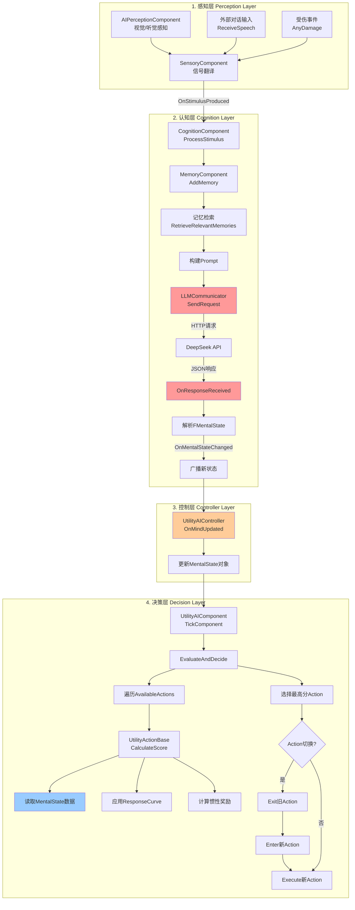

# LLM+Utility AI 数据流转分析报告

## 📊 完整数据流转图



## 🐛 发现的Bug和问题

### ❌ **Bug #1: 数据结构不一致 (Critical)**

**位置:** `LLMCommunicator.h` vs `UNPCMentalState.h`

**问题描述:**
- `FMentalState` (结构体) 和 `UNPCMentalState` (UObject) 定义了**两套不同的数据结构**
- 在数据流转中存在**类型转换缺失**

**代码证据:**

```cpp
// LLMCommunicator.h (Line 12-20)
struct FMentalState {
    float Anger = 0.0f;
    float Fear = 0.0f;
    float Confidence = 0.0f;
    float SocialBattery = 0.0f;
    float Hunger = 0.0f;
};

// UNPCMentalState.h (Line 27-42)
class UNPCMentalState : public UObject {
    float Anger;
    float Fear;
    float Confidence;
    float SocialBattery;
    float Hunger;
};
```

**影响:**
- LLM返回的是 `FMentalState` 结构体
- Utility AI读取的是 `UNPCMentalState` 对象
- 需要在 `UtilityAIController::OnMindUpdated` 中手动逐字段复制

**建议修复:**
1. **方案A (推荐):** 统一使用 `UNPCMentalState`，删除 `FMentalState`
2. **方案B:** 在 `UNPCMentalState` 中添加 `FromStruct` 和 `ToStruct` 转换函数

---

### ❌ **Bug #2: MemoryComponent未正确初始化 (High)**

**位置:** `CognitionComponent::BeginPlay()` (Line 42)

**问题代码:**
```cpp
void UCognitionComponent::BeginPlay() {
    // ...
    MemoryComp = CreateDefaultSubobject<UMemoryComponent>(TEXT("Memory")); // ❌ 错误!
}
```

**问题分析:**
- `CreateDefaultSubobject` **只能在构造函数中调用**
- 在 `BeginPlay` 中调用会导致崩溃或返回 `nullptr`

**正确做法:**
```cpp
// CognitionComponent.h
UCognitionComponent::UCognitionComponent() {
    MemoryComp = CreateDefaultSubobject<UMemoryComponent>(TEXT("Memory"));
}
```

**影响:**
- `MemoryComp` 始终为 `nullptr`
- `ProcessStimulus` 中的 `MemoryComp->AddMemory()` 不会执行
- 记忆系统完全失效

---

### ⚠️ **Bug #3: 缺少空指针检查 (Medium)**

**位置:** `CognitionComponent::ProcessStimulus()` (Line 60-66)

**问题代码:**
```cpp
FString Prompt = FString::Printf(TEXT(
    "Memories:\n%s\n"
    "Event: %s\n"
    // ...
), *ContextMemory, *SituationDescription);

LLMService->SendRequest(
    SituationDescription,  // ❌ 应该传 Prompt，而不是 SituationDescription!
    FOnLLMResponse::CreateUObject(this, &UCognitionComponent::OnLLMReply)
);
```

**问题分析:**
- 构建了完整的 `Prompt` (包含记忆上下文)
- 但实际发送给LLM的是 `SituationDescription` (只有当前事件)
- **记忆检索逻辑被浪费**

**修复:**
```cpp
LLMService->SendRequest(
    Prompt,  // ✅ 使用完整Prompt
    FOnLLMResponse::CreateUObject(this, &UCognitionComponent::OnLLMReply)
);
```

---

### ⚠️ **Bug #4: 并发请求冲突 (Medium)**

**位置:** `LLMCommunicator.cpp` (Line 19, 50)

**问题代码:**
```cpp
void ULLMCommunicator::SendRequest(const FString& UserInput, FOnLLMResponse OnComplete) {
    CurrentCallback = OnComplete;  // ❌ 直接覆盖!
    // ...
}

void ULLMCommunicator::SendRequestRaw(const FString& Prompt, FOnLLMResponseRaw OnComplete) {
    CurrentRawCallback = OnComplete;  // ❌ 直接覆盖!
    // ...
}
```

**问题分析:**
- 如果同时发送多个请求 (例如: 感知事件 + Dreaming)
- 后发送的回调会**覆盖**前一个
- 前一个请求的响应会触发**错误的回调**

**场景示例:**
```
时间线:
T0: 发送请求A (CurrentCallback = CallbackA)
T1: 发送请求B (CurrentCallback = CallbackB)  ← 覆盖了CallbackA
T2: 请求A返回 → 触发CallbackB (错误!)
T3: 请求B返回 → 触发CallbackB (正确，但A的结果丢失)
```

**建议修复:**
使用 `TMap<FHttpRequestPtr, Delegate>` 存储多个回调

---

### ⚠️ **Bug #5: Dreaming功能未集成 (Medium)**

**位置:** `CognitionComponent::StartDreaming()`

**问题分析:**
- `StartDreaming()` 函数已实现
- 但**没有任何地方调用它**
- 长期记忆整合功能实际上未启用

**建议:**
在 `UtilityAIController` 或 `GameMode` 中添加定时器:
```cpp
void AUtilityAIController::BeginPlay() {
    // ...
    GetWorldTimerManager().SetTimer(
        DreamingTimer,
        [this]() { CognitionComp->StartDreaming(); },
        300.0f,  // 每5分钟
        true
    );
}
```

---

### ⚠️ **Bug #6: 惯性奖励未生效 (Low)**

**位置:** `UtilityActionBase::CalculateScore()` (Line 67-79)

**问题代码:**
```cpp
// 3. 惯性奖励 (Inertia / Momentum)
/*
if (UUtilityComponent* UtilityComp = Controller->FindComponentByClass<UUtilityComponent>())
{
    if (UtilityComp->GetCurrentAction() == this)
    {
         FinalScore += InertiaBonus;
    }
}
*/
```

**问题分析:**
- 惯性奖励逻辑被**注释掉**
- 实际在 `UtilityAIComponent::EvaluateAndDecide()` (Line 77-80) 中实现
- 但这意味着惯性奖励**不受配置表控制**，而是硬编码

**影响:**
- 配置表中的 `InertiaBonus` 字段无效
- 所有Action使用相同的惯性值

---

### ⚠️ **Bug #7: 冷却时间计算错误 (Low)**

**位置:** `UtilityActionBase::CalculateScore()` (Line 37-40)

**问题代码:**
```cpp
if (CurrentTime - LastExecutedTime < CooldownTime) {
    return 0.0f; 
}
```

**问题分析:**
- `LastExecutedTime` 初始值为 `-9999.0f`
- 第一次执行时: `CurrentTime - (-9999) = 很大的正数`
- 条件 `很大的正数 < CooldownTime` 永远为 `false`
- **第一次执行不受冷却限制** (这可能是设计意图，但应该明确注释)

---

## ✅ 数据流转完整性检查

| 阶段 | 输入 | 输出 | 状态 |
|------|------|------|------|
| 感知 → 翻译 | `FAIStimulus` | `FString` | ✅ 正常 |
| 翻译 → 认知 | `FString` | `ProcessStimulus()` | ✅ 正常 |
| 认知 → 记忆 | `FString` | `AddMemory()` | ❌ Bug #2 |
| 记忆 → LLM | `FString` | HTTP请求 | ⚠️ Bug #3 |
| LLM → 解析 | JSON | `FMentalState` | ✅ 正常 |
| 解析 → 控制器 | `FMentalState` | `OnMindUpdated()` | ✅ 正常 |
| 控制器 → 状态对象 | `FMentalState` | `UNPCMentalState` | ⚠️ Bug #1 |
| 状态对象 → Utility | `UNPCMentalState` | `CalculateScore()` | ✅ 正常 |
| Utility → 动作 | `float Score` | `Execute()` | ✅ 正常 |

---

## 🔧 优先级修复建议

### P0 (必须修复)
1. **Bug #2:** 修复 `MemoryComponent` 初始化
2. **Bug #3:** 修复 `Prompt` 传递错误

### P1 (强烈建议)
3. **Bug #1:** 统一数据结构
4. **Bug #4:** 解决并发请求冲突

### P2 (可选优化)
5. **Bug #5:** 启用 Dreaming 功能
6. **Bug #6:** 修复惯性奖励配置
7. **Bug #7:** 明确冷却时间逻辑

---

## 📝 总结

### 架构优点 ✅
- 清晰的分层设计 (感知-认知-决策)
- 解耦的组件化架构
- 异步LLM调用不阻塞游戏主线程

### 主要问题 ❌
1. **数据结构冗余** (两套MentalState)
2. **组件初始化错误** (MemoryComponent)
3. **参数传递错误** (Prompt未使用)
4. **并发安全问题** (回调覆盖)

### 建议改进 💡
1. 添加单元测试验证数据流转
2. 使用 `TSharedPtr` 管理异步回调
3. 添加更详细的日志追踪
4. 实现请求队列机制

---

**生成时间:** 2026-01-03  
**分析者:** Antigravity AI  
**项目版本:** UE 5.3+
