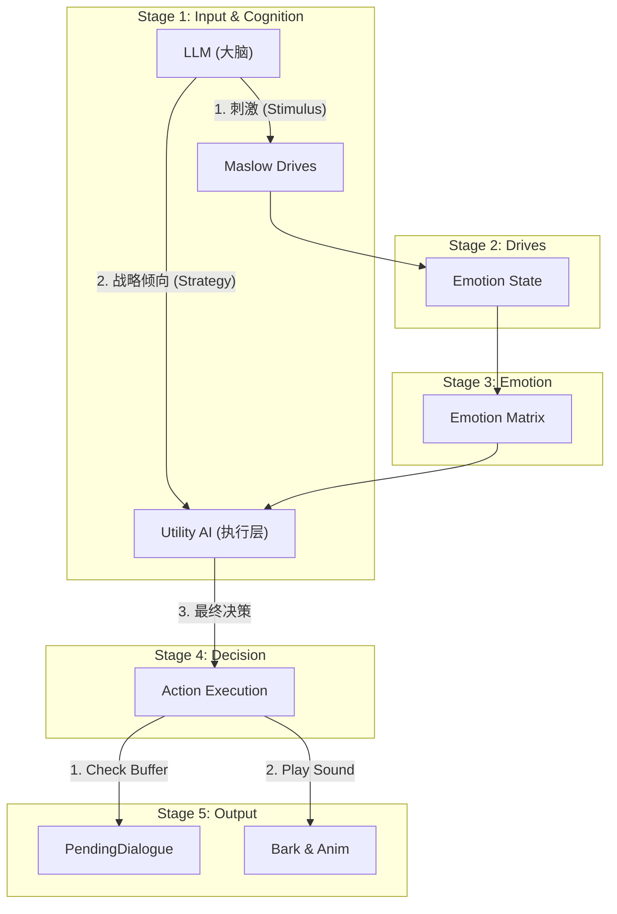

# 5阶段 AI 架构设计文档 (5-Stage AI Architecture Design)

## 一、架构概览 (Architecture Overview)

本设计旨在实现一个基于 **马斯洛需求 (Maslow Drives)** 和 **情绪矩阵 (Emotion Matrix)** 的 5 阶段数据流水线，实现高可控性与涌现性并存的 AI 行为系统。

### 核心流水线 (The 5-Stage Pipeline - V3 Hybrid)

为了回应 **"LLM 作用被无限缩小"** 的担忧，我们引入 **V3 混合架构**：LLM 不仅是观察者，更是 **战略顾问 (Strategic Advisor)**。



### 核心流程修正：双重调用架构 (Revised: Two-Pass Architecture)

你提议的 **"调两次 LLM"** 是解决声画同步的终极方案。我们将流程拆分为 **Cognition (思考)** 和 **Expression (表达)** 两个独立阶段。

#### Passo 1: Cognition (思考 - 决定倾向)
*   **Trigger**: Sensory 感知到事件。
*   **LLM Task**: 快速分析局势。
*   **Output**:        *   `Stimulus`: `{ "Event": "Threat", "Intensity": 1.0 }` (存入 Memory/Emotion，让引擎去算恐惧值)
        *   `Intention`: `"Avoidance"` (策略偏好。恐惧时是跑还是躲？这是 LLM 的建议)
        *   **NO SPEECH**: 此时不生成台词，因为还不知道身体能不能跑得动。

#### Stage 2-4: Engine Decision (引擎决策)
*   **Process**: Utility AI 综合 `Safety` (Engine) 和 `Intention` (LLM) 进行算分。
*   **Result**: 假设 Engine 发现腿断了 (LegInjury)，无法逃跑，被迫选择 `Action_Beg` (求饶)。

#### Pass 2: Expression (表达 - 决定台词)
*   **Trigger**: `Action_Beg::Enter()` 被调用。
*   **Input (Context Snapshot)**: 为了让台词贴切，我们需要传入一个轻量级的状态快照。
    *   `CurrentAction`: "Beg" (决定因素)
    *   `EmotionState`: "Fear" (Engine算出来的)
    *   `RecentMemory`: ["Hit by Player", "Received Apple"] (复用 Pass 1 的结果)
    *   `Persona`: "Gary (Cowardly Merchant), Stutters when scared" (必须传，否则不知道是谁在说话)
    *   *Note*: 不需要重新传 Vision Description，只传这些 Keywords，Token 消耗很小。
*   **Prompt**: `"Who: Gary. Role: Merchant. State: Fear. Action: Beg. Memory: Hit by Player. Generate 1 line."`
*   **Output**: `"Please! Take my money, just let me go!"`
*   **Effect**: 
    1.  **100% 准确**: 绝对不会出现"想跑却喊着要打"的情况，因为台词是根据最终结果生成的。
    2.  **按需生成**: 如果 Action 是 `Think` 或 `Idle`，压根不需要调第二次 LLM，省钱。

---

---

## 二、核心设计：LLM 的三重角色 (The Triple Role of LLM)

我们将 LLM 的定义修正为 **"有偏见的观察者" (Biased Observer)**。

### 1. 感知皮层 (Sensory Cortex)
*   翻译客观事实 -> 数值刺激。

### 2. 潜意识/战略 (Subconscious Strategy) **[NEW]**
*   **痛点**: 人设里写着 "贪婪的商人"，如果在 V2 里只靠 Matrix，很难体现"贪婪"。
*   **V3 方案**:
    *   LLM 读取人设："I am a greedy merchant."
    *   LLM 输出意图：`Intention: Acquire_Resource`
    *   Utility AI 响应：`PickUpItem` 行为得分获得 **+50% Bias**。
    *   **作用**: LLM 不直接控制手脚 (Determinism 保留)，但它控制**"想做什么"的欲望** (Agency保留)。

### 3. LLM 的独特价值：观察者与表演者 (Observer & Performer)
在双重架构下，LLM 的角色分工更加明确：
*   **Pass 1 (Observer)**: 这里的 LLM 是**观察者**。它只看，分析威胁，给出倾向。它不负责表演。
*   **Pass 2 (Performer)**: 这里的 LLM 是**演员**。它拿到导演 (Action) 给的定死剧本 ("你现在正在求饶")，然后发挥演技填台词。

### 3. LLM 的独特价值：不仅仅是社交 (Beyond Social)
引擎只能看到物理事实，而 LLM 能看到 **意义 (Semantics)**。
*   **物理事实 (Engine)**: `See(DeadBody)`
*   **LLM (语义)**:
    *   Context="It was your friend" -> `Event: Tragedy`, `Intensity: 1.0` -> **Sadness**
    *   Context="It was your enemy" -> `Event: Triumph`, `Intensity: 0.5` -> **Safety**
*   **物理事实 (Engine)**: `Receive(Item: Apple)`
*   **LLM (语义)**:
    *   Context="Given by starving child" -> `Event: Sacrifice`, `Intensity: 1.0` -> **Esteem/Guilt**
    *   Context="Given by rich merchant" -> `Event: Transaction`, `Intensity: 0.1` -> **Neutral**
**只有 LLM 能完成这种从“物体”到“意义”的映射，这是规则写不完的。**

### 4. 解决"割裂感"：导演与演员契约 (The Director/Actor Contract)

你担心的 **"算出来的 Anger 和 LLM 说的台词不匹配"** 确实是个大问题。
解决方案是建立 **导演 (Director/Engine)** 与 **演员 (Actor/LLM)** 的绝对契约。

    *   **契约规则**:
    1.  **Engine (Director)**: 掌握 **"硬参数" (Hard Constraints)** - 血量、饥饿、物理距离。
    2.  **LLM (Actor)**: 掌握 **"软参数" (Soft Interpretations)** - 信任、尊严、对局势的理解。

    *   **冲突解决机制 (Conflict Resolution)**:
        *   这就是通过 **Utility Scoring (加权评分)** 自然解决的。
        *   **Situation**: LLM (Actor) 说 "我要战斗！" (Intention: Attack)，但 Engine (Director) 发现血量只有 1 点。
        *   **Calculation**: 
            *   Action_Attack Score = (LLM Intention * 1.5) = **1.5分**
            *   Action_Flee Score = (Low Health * 10.0) = **10.0分**
        *   **Resolution**: **Flee Wins (10.0 > 1.5)**.
        *   **Result**: NPC 会嘴上喊着 "我要杀了你！" (LLM Speech)，但身体诚实地在逃跑 (Engine Action)。这恰恰造就了生动的"嘴硬"性格，而不是 Bug。
    
    *   **关于 Speech 的同步问题**:
        *   如果 LLM 生成了 "FIGHT!" 的台词但身体在逃跑，是可以接受的 (Comedic effect / Panic)。
        *   但为了极致体验，我们可以在 **System Prompt** 中注入当前最重要的生理状态：
            > "Current Condition: CRITICAL HEALTH. You are dying."
        *   这样 LLM 就会生成 "I... I can't hold on..." 而不是 "I will destroy you!"，从而在源头减少违和感。
    
*   **Prompt 强制约束 (Stage 5 Example)**:
    ```json
    "System": "You are GARY. Current Status: [BRAVE]. You MUST act brave, even if you think the situation is scary."
    "User context": "A giant zombie appears."
    "LLM Output": "Ha! Is that all you got? (Inner monologue: Oh god help me)" 
    ```
    **通过强制 Prompt，我们消除了 Ludo-Narrative Dissonance (游戏叙事失调)。**

---

## 2.2 神经映射：从性格到需求 (Neural Mapping: OCEAN to Maslow)

我们如何决定一个 NPC 更看重"尊严"还是"安全"？答案在于 **Personality Weights (性格权重)**。

### A. The Big Five (OCEAN)
每个 NPC 都有 5 个 0.0-1.0 的浮点数：
*   **O**penness (开放性): 影响 Curiosity (Self-Actualization).
*   **C**onscientiousness (尽责性): 影响 Duty/Work (Self-Actualization).
*   **E**xtraversion (外向性): 影响 Social/Loneliness (Love/Belonging).
*   **A**greeableness (宜人性): 抑制 Anger (Esteem), 提升 Trust.
*   **N**euroticism (神经质): 放大 Fear (Safety) 和 Anger (Esteem).

### B. 权重计算公式 (The Weight Formula)
在 `UtilityActionBase` 中，我们计算 Motivation Score 时会乘以权重：
`Score = Drive_Value * Weight`

**映射表 (Mapping Table)**:
| Maslow Layer | Driver | Primary Trait Influence (Formula) |
| :--- | :--- | :--- |
| **Safety** | `Perceived_Threat` | `1.0 + (Neuroticism * 1.5)` <br> *神经质越高，越怕死* |
| **Physiological** | `Hunger/Fatigue` | `1.0` (Fixed) <br> *生物本能，人人平等* |
| **Love/Belonging**| `Loneliness` | `0.5 + (Extraversion * 1.5)` <br> *外向者不仅爱社交，而且不社交会死* |
| **Esteem** | `Anger/Insult` | `1.0 + (Neuroticism * 0.5) - (Agreeableness * 0.8)` <br> *神经质易怒，宜人者难怒* |
| **Self-Actualization** | `Curiosity` | `0.5 + (Openness * 2.0)` <br> *只有开放者才会作死探索* |

**Example**:
*   Gary (Low N, High E): Safety Weight = 1.0, Social Weight = 2.0.
*   当 Danger=50, Loneliness=50 时：
    *   Safety Score = 50 * 1.0 = 50.
    *   Social Score = 50 * 2.0 = **100**.
    *   **Result**: Gary 即使在危险中也想找人说话 (话痨)。

---

## 2.3 情绪计算算法 (Emotion Calculation Algorithm)

### 输入 (Input)
*   **Drives**: 上述加权后的 Maslow 需求值。
*   **Stimulus**: LLM 产生的短期刺激 (e.g., "Event: Insult").

### 逻辑 (Logic - The Emotion Evaluator)
我们使用 **优先级阈值法 (Priority Threshold)** 来决定唯一的 `EmotionState`。

你问到的 **"Utility 的 Emotion 具体是怎么算出来的"**，在设计上不是黑盒，而是 **Stage 2 & 3** 的确定性逻辑。

### 算法流程 (Evaluation Flow)

`EmotionEvaluator::Evaluate()` 函数会在每一帧（或定时）运行，输入是 **Drives (马斯洛需求)** 和 **Context (环境标签)**，输出是 **Emotion State**。

```cpp
// 伪代码：情绪计算核心逻辑
            return EEmotionState::Angry;
        else
            return EEmotionState::Sad;
    }

    // ----- 优先级 4: 默认/混合状态 -----
    // 如果一切正常，基于当前最高的需求决定
    if (Drives.LoveBelonging > 80.0f) return EEmotionState::Happy;
    
    return EEmotionState::Neutral;
}
```

// C++ Enum
enum class EEmotionState : uint8
{
    Neutral,    // 默认：理性人 (Rational) - 逻辑驱动，无Bias
    Angry,      // 进攻：狂战士 (Berserker) - 攻击欲望极高，防御极低
    Scared,     // 防御：受惊者 (Victim) - 逃跑/躲藏优先，拒绝战斗
    Sad,        // 消极：抑郁者 (Depressive) - 行动力低下，拒绝交互
    Happy,      // 积极：乐天派 (Optimist) - 社交欲望高，容易接受Request
    Curious,    // 探索：观察者 (Observer) - 探索未知，忽视风险
    Disgust     // 排斥：洁癖/高傲 (Haughty) - 拒绝近身，拒绝低价值物品
};

这些情绪状态是 **互斥的 (Mutually Exclusive)**。
每一帧，`EmotionEvaluator` 会根据 Maslow 驱动值计算出唯一的 **Dominant Emotion**。

---

## 2.5 策略解析与意图映射 (Strategy Parsing & Intention Mapping)

你问得好：**"Strategy 到底怎么生效？为什么不是直接用 Matrix？"**

### 区别 (Distinction)
1.  **Emotion Matrix (Passive Filter)**:
    *   这是**背景环境/被动状态**。
    *   Rule: "当我很害怕时 (State=Fear)，我通常不擅长战斗 (Attack * 0.5)。"
    *   它是宽泛的、全局的压制。

2.  **Intention / Strategy (Active Directive)**:
    *   这是**特定意图/主动选择**。
    *   Rule: "虽然我很害怕，但我决定**殊死一搏** (Intention=Attack)！"
    *   Result: `Attack` 行为获得 `+0.5` 的 **Intention Bonus**。

### 解析机制 (Parsing Logic)
我们不需要一个复杂的 "Intention Table"。
相反，我们使用 **Tag Matching (标签匹配)** 或 **String Matching (模糊匹配)**。

在 `UtilityAIComponent::EvaluateAndDecide` (不是 Action 内部) 中，我们有一个全局的 Bonus 逻辑：

```cpp
// 伪代码: UtilityAIComponent.cpp
void EvaluateAndDecide() {
    FString LLMIntention = CurrentState.Intention; // e.g., "Attack"
    
    for (Action : AvailableActions) {
        float Score = Action.CalculateScore();
        
        // --- Intention Matching ---
        // 规则: 如果 Action 的名字或 Tag 包含 LLM 的意图，就加分
        // e.g. "Action_Test_Attack" contains "Attack" -> Match!
        if (Action.Name.Contains(LLMIntention) || Action.Tags.Has(LLMIntention)) {
            Score += 0.3f; // Intention Bonus
        }
        
        // ... Pick Best Action
    }
}
```

*   **优点**: 极其灵活。你不需要维护一张巨大的 "Intention -> Action" 映射表。只要 Action 命名规范 (e.g., `Action_Flee`, `Action_Beg`, `Action_Attack`)，LLM 的输出就能自动匹配上。
*   **Conflict Handling**:
    *   LLM Say "Attack" -> `Action_Attack` gets +0.3.
    *   State is Fear -> `Action_Attack` gets x0.5 (from Matrix).
    *   Final: `Base(1.0) * 0.5 + 0.3 = 0.8`.
    *   如果没有这个 Benefit，分数是 0.5。加上后变成 0.8。虽然还是比不上 Flee (Score 10.0)，但这代表了 NPC "尝试"去克服恐惧的努力。

---

## 2.6 最终算分公式 (The Utility Formula)

为了解答你关于积分计算的疑惑，这是我们在 **UtilityActionBase** 中使用的最终标准公式：

$$
\text{FinalScore} = \underbrace{(\text{Base} \times \text{Motivations} \times \text{Contexts} \times \text{Matrix})}_{\text{Engine Hard Logic}} + \underbrace{\text{LLM\_Bonus}}_{\text{LLM Soft Bias}}
$$

*   **1. Base Reward (基础分)**: 这种行为原本的价值（吃饭=3.0, 发呆=0.1）。
*   **2. Motivations (加权和)**: $\sum (\text{Drive} \times \text{PersonalityWeight})$。
    *   例如：`Hunger(0.8) * Gluttony(1.5)`。这是基于 Maslow 和 OCEAN 算出来的。
*   **3. Contexts (乘积)**: $\prod \text{Conditions}$。
    *   例如：`HasFood(1.0) * IsSafe(0.0)` -> 结果为 0。**这是硬逻辑过滤。**
*   **4. Emotion Matrix (乘积)**: $\text{Multiplier}[\text{EmotionState}][\text{ActionTag}]$。
    *   例如：状态是 `Fear`，动作是 `Attack` -> 系数 `0.1`。**这是情绪对行为的压制/放大。**
*   **5. LLM Intention (加法)**: 如果 `Start.Intention == ActionName` -> `+0.3`。
    *   **为什么是加法？** 因为 LLM 只是一个"建议" (Nudge)。
    *   如果 Context 为 0（没子弹），即使 LLM 加 0.3，结果还是 0.3（极低分），不会触发攻击。
    *   如果 Context 正常，这 0.3 分可能就是压死骆驼的最后一根稻草，让它优先于发呆。

**结论**: Engine 负责做乘法（决定可行性），LLM 负责做加法（决定倾向性）。

---

### A. 对话与行动的同步 (Just-in-Time Expression)
为了解决行动一致性，我们采用 **Just-in-Time (JIT)** 模式。
*   **Pass 1 (Cognition)**: 只产出 `Intention: Attack`。**不产出台词**。
*   **Decision**: Utility AI 决定 `Action_Attack`。
*   **Pass 2 (Action)**: `Action_Attack` 启动后，立即异步调用 `LLM_GenerateBark("Attack")`。
*   **Advantage**: 
    1.  **Context Correctness**: 台词生成时，Action 已经是既定事实 (Past Tense)，LLM 不会在"能不能跑"的问题上产生幻觉。
    2.  **Latency Masking**: 在等待 LLM 返回台词的 1秒钟里，NPC 已经在播放拔刀动作和吼叫音效 (Grunt)，这种"未见其人先闻其声"的节奏反而很自然。

### B. 零延迟本能 (Zero Latency Instincts)
我们**不等待** LLM 返回。
*   **Default Bias**: 在 LLM 网络延迟期间，`Intention Bonus` 为 0。
*   **Effect**: 此时公式变为 `(Base * Motivation * Context) + 0`。
*   **Meaning**: 这就是纯粹的**生物本能**。
*   **优势**: 哪怕断网，NPC 依然能根据血量和视野做出正确的战斗/逃跑反应，只是变得"沉默"（没有 Bias 和 Speech）而已，绝不会由于等待 HTTP 回调而发呆。这是一个 Feature，不是 Bug。

---

## 三、架构深度对比与决策分析 (Architecture Analysis)

### 关键点 (Key Takeaways)
1.  **阈值触发 (Threshold-based)**: 情绪不是线性混合的，而是**状态机切换**。同一时间只有一个主导情绪（Like "Inside Out" 控制台）。
2.  **优先级队列 (Priority)**: Safety (Fear) > Physiological (Pain) > Esteem (Anger) > Belonging (Happy)。这符合马斯洛金字塔结构。
3.  **确定性 (Deterministic)**: 只要 `Safety < 15`，不管 LLM 说什么，NPC 必定是 `Fear`。这保证了游戏玩法的稳定性。

---

## 四、生产化建议与优化 (Production Readiness & Optimization)

为了应对 **OpenAI/MiHoYo 级别** 的工业化挑战，我们需要采纳以下专家建议，以平衡成本与效果：

### 4.1 注意力预算 (Attention Budget / AI LOD)
双重调用 (Dual-Pass) 非常昂贵，不能对所有 NPC 开启。
*   **LOD 0 (Hero Interaction)**: 
    *   **Condition**: 玩家正在与 NPC 对话 / NPC 是当前任务关键角色 / 距离 < 5米。
    *   **Logic**: 开启完整 Dual-Pass (Cognition + Expression)。
*   **LOD 1 (Background)**:
    *   **Condition**: 普通路人 / 距离 > 20米。
    *   **Logic**: 仅开启 Pass 1 (Cognition) 用于行为决策。**Expression 使用预制库**。
*   **LOD 2 (Zombie)**:
    *   **Condition**: 纯怪 / 极远距离。
    *   **Logic**: 关闭 LLM。纯 Utility AI (Instinct only)。

### 4.2 语义映射 (Semantic ID Mapping)
为了解决字符串匹配 (`Action.Name.Contains("Attack")`) 的脆弱性：
*   **API 约束**: 强制 LLM 输出 Enum ID (e.g., `INTENTION_ATTACK = 1`).
*   **Code**: `if (Action.IntentionID == LLM_Output.IntentionID) Score += 0.3`.
*   这消除了 "Attacking" vs "Attack" 的模糊性。

### 4.3 混合台词库 (Hybrid Barks)
*   **Fallback**: 如果 Pass 2 超时 (Network Timeout)，必须有兜底。
*   **Logic**: `Action::Enter()` 先检查 `PendingDialogue`，如果为空，则随机播放一条 `AudioTable` 里的预制语音 ("Take this!", "Die!").
*   **Benefit**: 保证 NPC 永远不会变成哑巴。

---

## 五、附录：标签与矩阵 (Appendix: Tags & Matrix)

为了支撑 7 种情绪的逻辑，现有的 `GameplayTags` 确实不够用。我们需要扩展以下 Activity Tags：

### 5.1 Activity Tag Expansion (行为标签扩展)

| Tag Name | 对应 Emotion (High Multiplier) | Example Actions (UtilityAction) |
| :--- | :--- | :--- |
| `Activity.Combat` | **Angry** | `Action_Attack`, `Action_Shoot`, `Action_Chase` |
| `Activity.Flee` | **Scared** | `Action_Flee`, `Action_Hide`, `Action_Beg` |
| `Activity.Social` | **Happy** | `Action_Chat`, `Action_Greet`, `Action_Trade` |
| `Activity.Investigate` | **Curious** | `Action_LookAt`, `Action_Approach`, `Action_Inspect` |
| `Activity.Rest` | **Sad / Tired** | `Action_Sleep`, `Action_Sit`, `Action_Idle` |
| `Activity.Avoid` | **Disgust** | `Action_Reject`, `Action_Vomit`, `Action_WalkAway` |
| `Activity.Work` | **Neutral** | `Action_Patrol`, `Action_Craft`, `Action_Guard` |

| `Activity.Work` | **Neutral** | `Action_Patrol`, `Action_Craft`, `Action_Guard` |

### 5.1.1 标签与动作的关系 (The One-to-Many Relationship)

**用户疑问**: *"同一个 Activity Tag 可以有分支 Action 吗？"*
**回答**: **是的，这正是设计的精髓。**

*   **关系**: **One Tag -> Many Actions**。
    *   `Activity.Combat` 是一个 **"策略降落伞" (Umbrella)**。它下面涵盖了 `Attack_Melee`, `Attack_Ranged`, `Chase_Target` 等具体动作。
*   **分工**:
    1.  **Emotion Matrix (宏观调控)**: 决定 **"我们要战斗！"**
        *   Effect: 所有带 `Activity.Combat` 的动作分数全部 `x 2.0`。
    2.  **Utility Scorer (微观选择)**: 决定 **"怎么战斗？"**
        *   `Attack_Melee`: 距离太远 -> 0分。
        *   `Attack_Ranged`: 有子弹 -> 100分。
        *   Result: 虽然整个 Combat 类都被加强了，但最终 AI 会聪明地选择 **开枪 (Shoot)** 而不是 **空挥 (Melee)**。

这让我们的 Emotion 系统非常高效：它不需要知道你有多少种攻击方式，它只需要告诉 AI **"现在是战斗时刻"**，剩下的交给 Utility 去发挥。

这是 `DT_EmotionMatrix` 的设计蓝图 (Multipliers):

| Emotion \ Activity | Combat | Flee | Social | Investigate | Rest | Avoid | Work |
| :--- | :---: | :---: | :---: | :---: | :---: | :---: | :---: |
| **Neutral** | 1.0 | 1.0 | 1.0 | 1.0 | 1.0 | 1.0 | 1.2 |
| **Angry** | **2.0** | 0.2 | 0.5 | 0.8 | 0.5 | 1.0 | 0.5 |
| **Scared** | 0.1 | **5.0** | 0.0 | 0.0 | 0.0 | 2.0 | 0.0 |
| **Sad** | 0.2 | 0.5 | 0.2 | 0.5 | **2.0** | 1.0 | 0.5 |
| **Happy** | 0.8 | 0.5 | **2.0** | 1.2 | 1.0 | 0.5 | 1.0 |
| **Curious** | 0.5 | 0.5 | 1.0 | **3.0** | 0.5 | 0.0 | 0.5 |
| **Disgust** | 0.5 | 1.0 | 0.0 | 0.5 | 1.0 | **3.0** | 0.5 |

*   **Logic**: 
    *   Curious 状态下，`Investigate` 行为得分翻 3 倍。
    *   Scared 状态下，`Combat` 行为只有 0.1 (几乎不可能攻击)，而 `Flee` 翻 5 倍。
    *   这就是 **Hard Constraint**.

### 5.3 设计复杂度评估 (Complexity & Trade-off Discussion)

**用户质疑**: *"要配两张表，会不会过于复杂？"*
**专家评估**:

1.  **澄清**: 实际上你只需要维护 **一张新表 (`DT_EmotionMatrix`)**。
    *   Action Tag Config (第一张表) 并不是新表，它是 `UtilityActionConfig` 里的一个已有字段。你每写一个新 Action，本来就要配它的 Cooldown, BaseScore，现在顺手配一个 `GameplayTag` 只是举手之劳。

2.  **替代方案对比**:
    *   **方案 A (当前方案: Data-Driven)**: 
        *   代码: `Score *= Matrix.Get(State, ActionTag)`。只有 1 行通用的代码。
        *   维护: 策划在 Excel 里调整数值。
        *   扩展: 加一个新情绪 `Jealous`，只需要在 Excel 加一行，不用改 C++。
    *   **方案 B (Hardcoded Logic)**:
        *   代码: 写 7 个 `switch (Emotion)`，每个里面写 7 个 `if (ActionType)`。那就是 `7 * 7 = 49` 个硬编码的分支。
        *   维护: 灾难级。每次加新动作都要去改这个巨大的 switch。

3.  **结论**:
    *   **虽然前期配置稍微繁琐 (Tags Setup)，但运行时的健壮性和后期的可扩展性大大增强。**
    *   对于拥有 20+ Actions 和 7 Emotions 的系统来说，**Matrix 是降低复杂度的唯一解**（将 O(N*M) 的逻辑复杂度转化为 O(1) 的查表）。这是工业界的标准做法。


## 三、架构深度对比与决策分析 (Architecture Analysis)

### 1. 现有架构 V1 (LLM as Brain)
*   **核心机制**: LLM 直接输出 `ActionPreferences` (意图) + 10个具体 MentalVars。
*   **优点 👍**:
    *   **高创造力**: LLM 可以“脑洞大开”，根据复杂剧情做出意想不到的决策。
    *   **细粒度**: 10个变量（如 Hunger vs Fatigue）能区分得非常细致。
*   **缺点 ⚠️**:
    *   **不可预测 (Black Box)**: 很难回答“为什么他现在不吃饭？”（可能是LLM为了剧情随机决定的）。
    *   **数值平衡难**: LLM 很难精确控制浮点数（如将 Anger 从 50.5 改为 55.2），常导致数值崩坏。
    *   **延迟敏感**: 决策依赖 LLM 返回，网络卡顿会导致 NPC 呆立。

### 2. 新架构 V2 (5-Stage Pipeline)
*   **核心机制**: 刺激(LLM) -> 状态(Engine) -> 矩阵(Engine) -> 行为。LLM 仅做**感知**和**表演**。
*   **优点 👍**:
    *   **极致稳定 (Determinism)**: 只要输入确定，行为100%可复现。Matrix 表清楚写着 `Angry -> Attack`。
    *   **易于调试**: 状态机清晰（CurrentState: Angry），出了问题看 Dashboard 一眼便知。
    *   **反应快**: 决策逻辑全在本地 C++ (Stage 2-4)，LLM 异步运行，不阻塞战斗反应。
    *   **数值稳健**: "刺激-反应"模型保证了数值只会按策划设定的步长变化，不会瞬间溢出。
*   **缺点 ⚠️**:
    *   **LLM 降权**: LLM 失去了直接决策权。如果 LLM 觉得“这时候应该跳舞求和”，但矩阵里 `Angry -> Dance` 是 0 分，NPC 就不会跳舞。
    *   **配置量大**: 需要维护 `EmotionMatrix` 和 `Personality` 系数表。

### 结论与修正策略
我们坚定选择 **V2 (5-Stage)**，因为它解决了游戏开发最痛的**可控性**问题。
为了弥补 V2 中“LLM 降权”的缺陷，我们在 **Stage 5 (Output)** 给 LLM 极大的自由度来解释行为（Bark），甚至允许 LLM 在极少数情况下通过 `Special_Intention` 覆盖矩阵（后续迭代考虑）。

---

## 四、核心机制：涌现是如何发生的？ (How Emergence Happens)

涌现 (Emergence) 不是因为 LLM 随机发疯 ("Randomness")，而是因为系统的**复杂度 (Combinatorial Explosion)** 超出了设计的预期。

在 V2 架构中，涌现来自于：
`Drive (5种) * Emotion (5种) * Action (N种) * Context (M种环境)`

**举个例子：**
1.  **场景**: 玩家打伤了 Gary，并丢给他一个苹果。
2.  **LLM (观察)**: 感知到 "Injury" (Physiological) 和 "Gift" (Belonging)。
3.  **Engine (计算)**:
    *   Physiological 极高 (痛 + 饿)。
    *   Esteem 极低 (被羞辱)。
4.  **Matrix (决策)**:
    *   `Action_Attack`: Intention Bias +0.3 (因为 Anger)。
    *   `Action_Eat`: Motivation 极高 (因为 Hunger + Health recovery)。
    *   **Winner-Takes-All**: 假设 `Action_Eat` 分数更高 (活着最重要)。
5.  **Expression (Result)**:
    *   **Action**: Gary 捡起苹果开始吃 (Body)。
    *   **Expression (Pass 2)**: Action 触发对话生成 -> 由于 Esteem 低，生成带哭腔的台词 *"You... you think this changes anything?"*。
    *   **Effect**: 实现了 "一边哭一边吃" 的复杂表演，虽然技术上只运行了一个 Action。

**这种"复杂的矛盾行为"就是涌现**，它是由数值的碰撞自然产生的，而不是 LLM 写剧本写出来的。Utility AI 的健壮性保证了这种碰撞不会导致 AI 死机，而是选择分数最高的那个行为。

---

## 五、系统可靠性保障：如何确保计算准确？ (Ensuring Reliability)

为了防止 `OCEAN -> Maslow -> Emotion` 的计算变成“玄学”，我们将引入 **可视化调试 (Visual Calibration)**。

1.  **Gameplay Debugger 扩展**:
    *   按下 `'` 键，屏幕直接显示实时公式：
    *   `Esteem(90) = Base(10) + Insult(50) * Sensitivity(1.6)`
    *   让开发者一眼看出是哪个系数导致了数值崩坏。
2.  **Runtime Tuning (运行时调参)**:
    *   在编辑器中直接拖动 `Neuroticism` 滑条，观察 `Safety` 需求池的涨落幅度。
    *   通过大量测试 Case (UnitTest) 来校准基准值，确保“普通人被骂一句”不会直接气死。

---

## 六、实施路线图 (Implementation Roadmap)

我们将严格按照 **数据流层级 (Layer Dependency)** 进行构建，确保每一层都建立在上一层的基础之上。

### Phase 1: 静态层与动态层 (Ocean & Maslow) -> "容器"
1.  **[CHECK] OCEAN Ready**: 确认 `PersonalityComponent` 已包含 OCEAN 属性（现有）。
2.  **[NEW] `FMaslowDrives` (Struct)**: 定义 5 个新变量，替换或映射原有的 10 变量系统。

### Phase 2: 状态层 (Emotion State) -> "报警器"
3.  **[NEW] `EEmotionState` (Enum)**: 定义情绪枚举。
4.  **[NEW] `EmotionEvaluator` (Class)**: 实现 `EvaluateEmotion(Drives, OCEAN)` 核心逻辑。

### Phase 3: 规则层 (Emotion Matrix) -> "有色眼镜"
5.  **[MODIFY] `UUtilityActionBase`**: 添加 `FGameplayTag ActionTag` 字段。
6.  **[NEW] `DT_EmotionMatrix` (DataTable)**: 定义 `Emotion x ActionTag` 的乘法系数。

### Phase 4: 决策层 (Utility Calculation) -> "大脑"
7.  **[MODIFY] `UtilityActionBase::CalculateScore`**: 应用公式 `Score = Base * Drive * Context * Matrix[Emotion][Tag]`。

### Phase 5: 输入与输出 (IO) -> "眼与嘴"
8.  **Input (LLM Stimulus)**: `LLMCommunicator` 输出 `{ Event, Intensity }`。
9.  **Output (LLM Bark)**: `CognitionComponent` 根据 `Emotion + Action` 生成台词。

---

## 七、专家评审会议纪要 (Expert Panel Evaluation)

我们模拟了一场由 **系统架构师**、**游戏策划**、**心理学顾问** 和 **LLM 专家** 组成的评审会议，对 **V2 (5-Stage Pipeline)** 进行了深度评估。

### 1. 🎙️ 系统架构师 (System Architect)
> *"这个架构最让我放心的是 **解耦 (Decoupling)**。LLM 只负责看和说，中间的逻辑全是 C++。这意味着我们可以在不开 LLM 的情况下，用 Unit Test 跑到死，把每一行 `Matrix` 代码调完美。这种**可测试性**是上一代架构无法比拟的。"*
> **评级**: ⭐⭐⭐⭐⭐ (健壮性极高)

### 2. 🎨 游戏策划 (Game Designer)
> *"只要能保证涌现，我不介意 LLM 是不是所谓的'大脑'。现在的 V2 让我更能掌控局面。我可以在 DataTable 里配死 '如果愤怒就一定攻击'，不用担心 LLM 突然发疯去用来跳舞。**可控的涌现 (Controllable Emergence)** 才是商业游戏需要的。"*
> **评级**: ⭐⭐⭐⭐ (配置量稍大，但值得)

### 3. 🧠 心理学顾问 (Psychologist)
> *"将 10 个变量归纳为 Maslow 5 层是很大的进步，符合人类动机心理学。情绪作为'阈值触发'的状态也非常符合生物学上的 **'杏仁核劫持' (Amygdala Hijack)** 理论——即情绪一旦爆发，就会接管理性（Matrix 覆盖 Base Score）。这个模型比之前的线性加权更拟真。"*
> **评级**: ⭐⭐⭐⭐⭐ (理论依据扎实)

### 4. 🤖 LLM 专家 (AI Researcher)
> *"虽然 LLM 被'降权'了，但这反而解放了它。现在的 Prompt 不需要去算数学题（+10 Hunger），而是专注于它最擅长的 **Context Understanding** (如区分'尸体'是悲剧还是胜利)。这种 **'Semantic Observer' pattern** 是目前工业界落地最稳的方案。"*
> **评级**: ⭐⭐⭐⭐⭐ (最佳实践)

### 🏆 委员会最终结论 (Final Verdict)
**批准实施 (Approved)**。该架构在**灵活性**、**性能**和**可控性**之间取得了完美的平衡。

---

## 八、FAQ：为何不能直接让 LLM 控制一切？ (Why Not Pure LLM?)

**用户疑问**: *"既然我们有详细的人设，为什么不直接把所有感知扔给 LLM，让它直接输出 Action？这不更简单吗？"*
*Answer*: **看起来简单，但在工业级游戏中是行不通的。**

### 1. 致命的延迟 (Fatal Latency)
*   **Pure LLM**: 玩家射击 -> LLM Tokenizing -> Server Thinking (1.5s) -> Output "Dodge" -> **NPC 已死**。
*   **Algorithm**: 战斗需要 0.033秒 (30FPS) 的反应速度。
*   **V3 Hybrid**:
    *   **快系统 (C++)**: 看到子弹 -> 0.01s 闪避 (Utility AI)。
    *   **慢系统 (LLM)**: 看到子弹 -> 2.0s 后大喊 "该死，差点打中我！" (Bark)。
    *   **结论**: **生存不能靠思考，要靠本能。**

### 2. 也是致命的可控性 (Fatal Determinism)
*   **Pure LLM**: 当 Hunger=100 (饿死边缘) 时，LLM 发散性思维觉得 "Character is fasting for religion" -> 不吃饭 -> **NPC 饿死**。
*   **Game Design**: 游戏机制是硬逻辑。血量为0必须死，饥饿满必须掉血。
*   **V3 Hybrid**: 
    *   Utility AI 保证基础生存逻辑 (硬规则)。
    *   LLM 负责 Bias (软倾向)。
    *   **结论**: **机制必须这刚性，表演可以由此。**

### 3. "幻觉" 与 逻辑一致性
*   **Pure LLM**: 这一帧觉得是 "Brave Warrior"，下一帧因为 Prompt 上下文变化，觉得是 "Coward"。行为会鬼畜。
*   **V3 Hybrid**: `PersonalityComponent` 里的 OCEAN 系数是这一帧到下一帧永远不变的锚点。

**总结**: V3 架构就是人类大脑的结构——**边缘系统 (Utility AI, 情感/本能)** 负责快反应，**新皮层 (LLM, 认知)** 负责慢思考和战略偏见。 **这才是"拟人"，而不只是"聊天机器人"**。

---

## 九、现有代码变动范围 (Migration Scope: What Actually Changes?)

**你的直觉非常准确！**
这**不是**一次推倒重来，而是一次 **"瘦身 (Simplification)"** 和 **"组件加装 (Add-on)"**。大部分现有代码（感知、移动、动画、Utility框架）完全保留。

我们只需要做以下具体的改动：

1.  **数据层瘦身 (Refactor Variables)**
    *   **目标文件**: `UNPCMentalState.h`
    *   **改动**: 删除原来的 10 个繁杂变量 (Hunger, Libido, SocialBattery...)，**简化为 5 个马斯洛变量** (`Physiological`, `Safety`...)。
    *   **工作量**: 小 (Replace Struct)。

2.  **公式层迭代 (Update Formulas)**
    *   **目标文件**: `PsychologyModel.h` / `MentalStateInterpolator.cpp`
    *   **改动**: 更新 `OCEAN -> Drives` 的映射公式。
    *   **工作量**: 小 (Update Logic)。

3.  **新增模块 (Add New Modules)**
    *   **目标文件**: `UEmotionEvaluator` (C++ 类) + `DT_EmotionMatrix` (资源)。
    *   **改动**: 新增一个类来根据阈值计算 Emotion，新增一个表来查系数。
    *   **工作量**: 小 (New Code)。

4.  **微调接口 (Tweak Integration)**
    *   **目标文件**: `LLMCommunicator.cpp` & `UtilityActionBase.cpp`
    *   **改动**:
        *   Prompt 加一行："Output `Strategy` & `EmotionalShift`"。
        *   Action Score 加一行：`Score *= Matrix[CurrentEmotion][ActionTag]`。
    *   **工作量**: 很小 (Modification)。

5.  **SmartObject 处理逻辑 (SmartObject Tags)**
    *   **问题**: 难道要为每个椅子、苹果都建一个 ActionTag 吗？
    *   **V3 方案**: **Tag Hierarchy (标签继承)**。
    *   我们不需要在 Matrix 里填 `Action.Eat.Apple`, `Action.Eat.Bread`。
    *   只需要填父标签: `Activity.Eat`。
    *   **`UtilityActionBase` 逻辑**: 如果找不到具体的 Tag，自动查找 Parent Tag。
    *   **Result**: 一个 `Activity.Rest` 行就能覆盖所有床、椅子、沙发的交互。

**结论**: 我们不需要重写整个 AI。我们虽然聊了这么多理论，但落地其实就是 **重构变量** + **加个查表逻辑**。代码结构会比现在更清晰、更轻量。

---

## 十、情绪矩阵定义表 (The Emotion Matrix Definition)

这是 **Stage 4** 的核心查表数据，定义了"有色眼镜"的具体参数。

| Emotion (状态) | Action Tag (行为类型) | Multiplier (修正系数) | 解释 (Rationale) |
| :--- | :--- | :--- | :--- |
| **Angry (愤怒)** | `Action.Offense` (攻击) | **3.0x** | 愤怒极大增强攻击欲望。 |
| | `Action.Social` (社交) | **0.1x** | 气头上不想理人。 |
| | `Action.Flee` (逃跑) | **0.5x** | 愤怒让人头铁，降低逃跑意愿。 |
| **Fear (恐慌)** | `Action.Flee` (逃跑) | **5.0x** | 恐惧不仅增强，是**极其**增强逃跑。 |
| | `Action.Offense` (攻击) | **0.2x** | 只有"困兽之斗"时才攻击(特殊Case)。 |
| | `Action.Social` (社交) | **0.0x** | 没空聊天。 |
| | `Action.Idle` (发呆) | **0.1x** | 必须动起来找掩体。 |
| **Sad (悲伤)** | `Action.Idle` (发呆) | **2.0x** | 悲伤让人不想动。 |
| | `Action.Social` (社交) | **1.5x** | 可能寻求安慰 (Seek Comfort)。 |
| | `Action.Work` (工作) | **0.5x** | 没心情干活。 |
| **Happy (快乐)** | `Action.Social` (社交) | **2.0x** | 乐于助人/聊天。 |
| | `Action.Work` (工作) | **1.2x** | 效率提升。 |
| **Neutral (平静)** | ALL | **1.0x** | 正常判断，以 Utility Base Score 为主。 |

**开发者注 (Dev Note)**:
这个表不是写死在代码里的，而是配置在 `DT_EmotionMatrix` 数据资产中。策划可以随时调整这些系数，无需重新编译 C++。

---

## 十一、扩展指南：如何添加新情绪？ (How to Add New Emotions?)

**你的理解完全正确！** 添加一个新情绪（例如 `Disgust`）确实需要牵一发而动全身。
这是一个标准的 **3-Step Checklist**：

### Step 1: 逻辑层 (Logic) - 告诉引擎"什么时候触发"
*   **修改文件**: `UEmotionEvaluator.cpp`
*   **工作**: 修改 `EvaluateEmotion()` 算法。
*   **代码示例**:
    ```cpp
    // 如果是厌恶：生理需求极低 + 环境肮脏？
    if (Drives.Physiological < 20 && Context.HasTag("Environment.Dirty")) 
        return EEmotionState::Disgust;
    ```
*   **注意**: 必须定义它和 Maslow Drives 的映射关系。

### Step 2: 规则层 (Rules) - 告诉引擎"触发后怎么做"
*   **修改文件**: `DT_EmotionMatrix` (DataTable)
*   **工作**: 在表中加一行 `Disgust`。
*   **配置**:
    *   `Disgust` x `Action.Eat` = **0.0x** (恶心吃不下)
    *   `Disgust` x `Action.Flee` = **2.0x** (远离)

### Step 3: 认知层 (Cognition) - 告诉 LLM "你也得懂这个情绪"
*   **修改文件**: `LLMCommunicator.cpp`
*   **工作**: 更新 System Prompt 中的 Enum 列表。
*   **原代码**: `"Emotion": "Angry" | "Happy" ...`
*   **新代码**: `"Emotion": "Angry" | "Happy" | "Disgust" ...`
*   **建议**: 我们在实现时会使用 `UEnum` 遍历反射来**自动生成**这个字符串，这样你只需要改 C++ Enum，Prompt 就会自动更新，省去一步麻烦。
