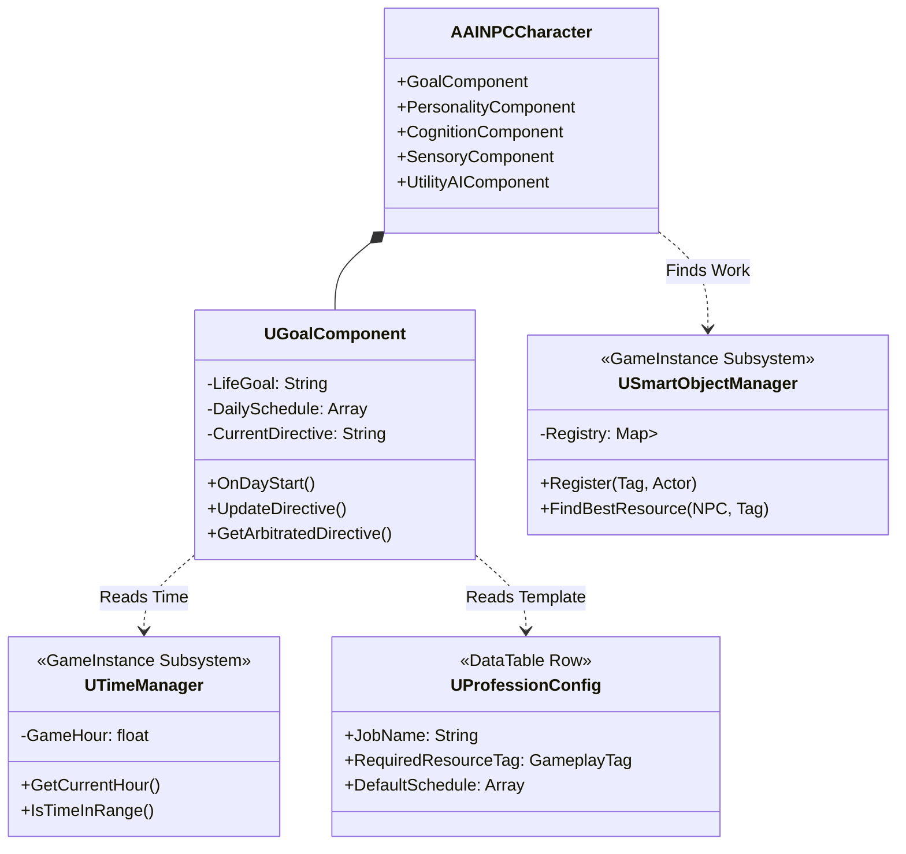

# AINPC 中等复杂度架构 - 技术设计文档 (TDD)
# Medium-Complexity AI Architecture - Technical Design Document

**文档状态:** [拟定中]  
**目标:** 提供可直接编码的详细技术规格  
**复杂度:** ⭐⭐⭐ 中等 (适合探索性 Demo)

---

## 1. 核心架构图 (System Overview)

### 1.1 组件类图 (Component UML)



---

## 2. 详细子系统设计

### 2.1 需求系统 (Core Needs)

**设计目标:** 用最少的变量驱动尽可能多的行为。

**文件:** `UtilityAI/MentalStateFields.h`

**精简变量定义 (6个核心):**

| 变量名 | 默认值 | 语义说明 | 影响行为示例 |
|--------|-------|----------|-------------|
| **Hunger** | 0.0 | 饥饿度 | >0.8 强制寻找食物 (Survival层) |
| **Fatigue** | 1.0 | 疲劳度 | <0.2 强制回家睡觉 (Survival层) |
| **Perceived_Threat** | 0.0 | 威胁感知 | >0.5 触发逃跑或战斗 (Survival层) |
| **Trust** | 0.5 | 信任度 | <0.3 拒绝交易, >0.8 解锁特殊对话 |
| **Anger** | 0.0 | 愤怒值 | >0.7 可能主动攻击或拒绝交流 |
| **Duty_Urgency** | 0.0 | 责任感 | 驱动工作行为 (Schedule层) |

---

### 2.2 目标与仲裁系统 (Goals & Arbitration)

**设计目标:** 解决 "如果你正在挖矿时有个僵尸来打你，你应该先挖矿还是先跑？" 的问题。

**文件:** `Components/GoalComponent.h`

**仲裁算法 (详细伪代码):**

```cpp
// 每帧调用 (Tick)
void UGoalComponent::UpdateArbitration()
{
    // === Layer 1: 生存与反应 (SURVIVAL) ===
    // 优先级最高: 只要有威胁或极度状态，马上覆盖一切
    
    if (Sensory->HasActiveThreat()) 
    {
        CurrentDirective = "DIRECTIVE.Combat.React"; 
        return; 
    }
    
    if (Needs->Hunger > 0.9f)
    {
        CurrentDirective = "DIRECTIVE.Survival.Eat";
        return;
    }
    
    if (Needs->Energy < 0.1f)
    {
        CurrentDirective = "DIRECTIVE.Survival.Sleep";
        return;
    }

    // === Layer 2: 社交交互 (SOCIAL) ===
    // 优先级中等: 打断工作，但被生存覆盖
    
    if (Social->IsInConversation() || Social->HasPendingWait)
    {
        CurrentDirective = "DIRECTIVE.Social.Interact";
        return;
    }

    // === Layer 3: 日程与职业 (SCHEDULE) ===
    // 优先级最低: 默认状态
    
    // 1. 获取当前时间对应的任务
    float CurrentHour = TimeManager->GetCurrentHour();
    FScheduleTask CurrentTask = GetTaskForTime(CurrentHour);
    
    // 2. 如果当前有任务，执行任务 Tag
    if (CurrentTask.IsValid())
    {
        CurrentDirective = CurrentTask.TaskTag; // e.g. "DIRECTIVE.Work.Mine"
    }
    else
    {
        CurrentDirective = "DIRECTIVE.Idle.Wander";
    }
}
```

---

### 2.3 智能对象与工作系统 (Smart Objects & Work)

**设计目标:** 解决 "我知道我要挖矿，但我去哪里挖？" 的问题。

**组件 1: 智能对象管理器 (注册表)**
**文件:** `Subsystems/SmartObjectManager.h`

```cpp
UCLASS()
class USmartObjectManager : public UGameInstanceSubsystem
{
public:
    // == 注册接口 ==
    // 用于 SmartObject 在 BeginPlay 时通知系统 "我在这里"
    // @param JobTag: 适合什么职业 (e.g. "Job.Miner")
    // @param Object: 对象指针
    void RegisterResource(FGameplayTag JobTag, AActor* Object);

    // == 查找接口 ==
    // 用于 NPC 查找工作地点
    // @param NPC: 谁在找？(用于计算距离)
    // @param JobTag: 找哪类工作？
    // @return: 最佳对象的指针，找不到返回 nullptr
    AActor* FindBestResourceFor(AActor* NPC, FGameplayTag JobTag);
    
private:
    // 核心数据: 资源标签 -> 对象列表的映射
    TMap<FGameplayTag, TArray<TWeakObjectPtr<AActor>>> ResourceRegistry;
};
```

**组件 2: 通用工作动作**
**文件:** `UtilityAI/Actions/Action_Work.h`

```cpp
// 这是一个通用的 Action，所有职业都用这一个 Logic
void UAction_Work::Enter()
{
    // 1. 获取我的职业数据
    FProfessionConfig* Prof = NPC->GoalComponent->GetProfession();
    
    // 2. 检查我要找什么资源 (e.g. "Interest.Ore")
    FGameplayTag TargetResourceTag = Prof->RequiredResourceTag;
    
    // 3. 询问管理器: "最近的空闲矿在哪？"
    AActor* BestWorkStation = SmartObjectManager->FindBestResourceFor(NPC, TargetResourceTag);
    
    if (BestWorkStation)
    {
        // 4. 尝试占用 (Claim)
        USmartObjectComponent* SO = BestWorkStation->FindComponent<USmartObjectComponent>();
        if (SO && SO->TryClaim(NPC)) // 这一步防止两个人抢一个矿
        {
            MoveTo(BestWorkStation);
            CurrentWorkStation = BestWorkStation;
        }
    }
    else
    {
        // 没找到工作点？转为发呆或抱怨
        FailAction("No resource found");
    }
}
```

---

### 2.4 日程与时间系统 (Schedule & Time)

**文件:** `Subsystems/TimeManager.h`

```cpp
// 抽象时间系统 (无日夜视觉，纯逻辑)
UCLASS()
class UTimeManager : public UGameInstanceSubsystem
{
public:
    // 获取当前逻辑小时 (0.0 - 24.0)
    float GetCurrentHour() const;
    
    // 时间流速因子 (e.g. 60.0 表示 1秒真实时间 = 1分钟游戏时间)
    float TimeScale = 60.0f; 
};
```

**文件:** `GoalComponent.h` (日程数据结构)

```cpp
USTRUCT(BlueprintType)
struct FScheduleTask
{
    // 任务对应的 Utility Directive Tag
    // e.g. "DIRECTIVE.Work.Mine" 或 "DIRECTIVE.Life.Sleep"
    UPROPERTY(EditAnywhere)
    FGameplayTag TaskTag; 
    
    // 开始时间 (e.g. 8.0)
    UPROPERTY(EditAnywhere)
    float StartHour;
    
    // 持续时间 (e.g. 4.0)
    UPROPERTY(EditAnywhere)
    float Duration;
};
```

---

### 2.5 LLM 混合式日程规划 (Hybrid Planning)

**逻辑流程:**

1.  **每天 6:00 AM (起床时刻):** `GoalComponent::OnDayStart()` 被触发。
2.  **检查条件:** 
    *   (A) 昨天是否发生了重大变故？(Memory查询)
    *   (B) 是否只是普通的一天？(Random Check)
3.  **分支执行:**
    *   **普通情况 (80%):** 
        `DailySchedule = ProfessionConfig->DefaultSchedule;`  
        (直接拷贝职业模板，0 Token消耗)
    *   **特殊情况 (20%):** 
        **Prompt:** "你昨天被【玩家】攻击了，这对你今天的计划有什么影响？你是【矿工】，通常你应该【去挖矿】，但你现在感到【恐惧】。"
        **LLM Output:** "我今天不敢出门，我要待在家里。" -> 生成新的 Schedule (Home, 24h)
        `DailySchedule = LLM_Generated_Schedule;`

---

## 3. 实现步骤 (Implementation Steps)

1.  **Step 1: 基础设施**
    *   创建 `UTimeManager` (Subsystem)
    *   创建 `USmartObjectManager` (Subsystem)
    *   精简 `MentalStateFields.h`

2.  **Step 2: 目标系统**
    *   创建 `UGoalComponent`
    *   实现 `UpdateArbitration()` (仲裁逻辑)

3.  **Step 3: 职业与配置**
    *   创建 `FProfessionConfig` (DataTable结构)
    *   配置 3 个基础职业 (Miner, Guard, Villager)

4.  **Step 4: AI动作连接**
    *   实现 `UAction_Work` (连接 SmartObjectManager)
    *   修改 `UtilityAIComponent` 以接收 `Directive`

5.  **Step 5: 验证**
    *   观察 NPC 在 8:00 是否自动去工作
    *   攻击 NPC，观察是否打断工作并反击
