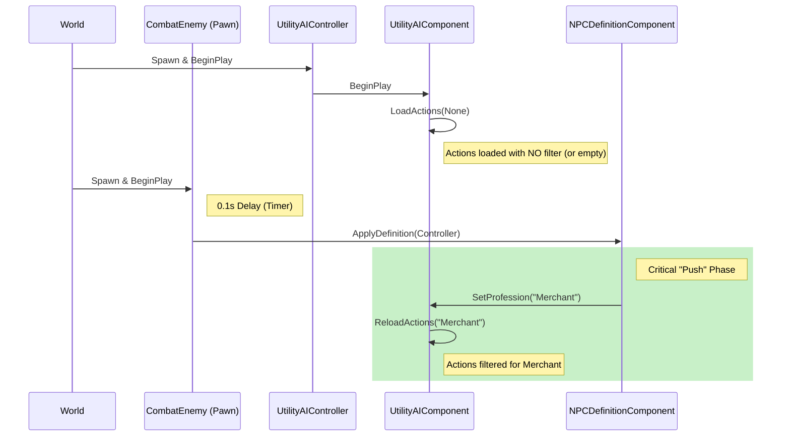

# NPC Initialization Architecture ("Push Model")

## Overview
To facilitate clean separation of concerns, the system uses a **Push Model** for initialization. Components like `UtilityAIComponent` do **not** pull data during their own `BeginPlay`. Instead, they wait for the "Captain" (`NPCDefinitionComponent`) to push the configuration to them.

## The Flow

## Why this is safe
1.  **Race Condition Avoidance**: By using a small delay (0.1s) and an explicit push, we ensure that the Controller and all its components are fully initialized and registered before we try to configure them.
2.  **Explicit Dependency**: `UtilityAIComponent` doesn't need to know *where* the Profession ID comes from (Personality, Save Game, Network). It just waits to be told what it is.
3.  **Hot Swapping**: This architecture supports changing professions at runtime (e.g., job change) by simply calling `SetProfession` again.

## FAQ

**Q: Won't `UtilityAIComponent` have empty values initially?**
A: Yes, strictly speaking, for the first 0.1 seconds, `CurrentProfessionID` is `None`. This is acceptable because:
1.  The AI logic ticks at 5Hz (0.2s), so it likely won't even tick before the configuration arrives.
2.  Even if it ticks, it will just use default behavior (or do nothing) for a single frame, which is invisible to the player.
