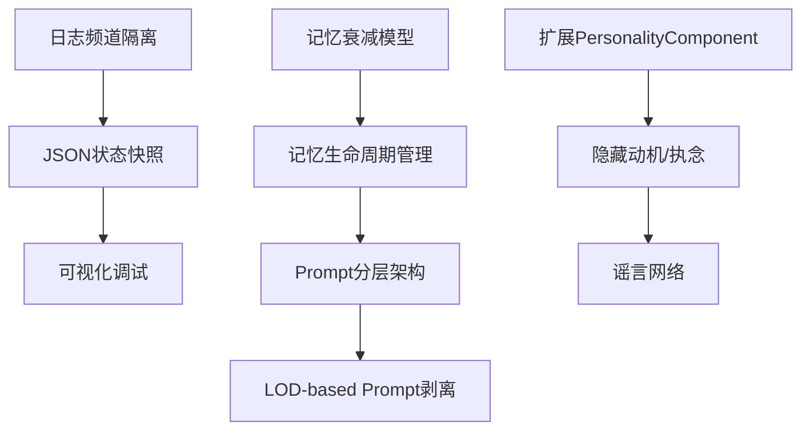

# AI System Enhancement Plan (Phase 4)
# AI 系统增强计划（第四阶段）

> **文档版本**: 1.0  
> **创建日期**: 2026-01-20  
> **目标**: 解决"记忆粘性"、增强NPC自主性、优化调试体验

---

## 📋 目录

1. [记忆系统重构 (Memory Refactor)](#1-记忆系统重构)
   - **核心修复**: [时态标注与语义修正](#a-核心方案时态标注与语义修正-temporal-annotation)
   - **过滤器**: [数学衰减模型](#b-辅助方案数学衰减模型-relevance-filter)
   - **结构支持**: [数据结构扩展](#c-扩展-fmemoryitem-结构)
2. [赋予"灵魂"与自主性 (Agency & Soul)](#2-赋予灵魂与自主性)
3. [AI友好型调试协议 (Debug Protocol)](#3-ai友好型调试协议)
4. [Prompt工程与性能优化 (Optimization)](#4-prompt工程与性能优化)

---

## 1. 记忆系统重构

### 1.1 当前状态分析

**现有结构** (`SocialTypes.h` + `MemoryComponent.h`):
```cpp
struct FMemoryItem {
    FGuid MemoryId;
    FDateTime Timestamp;
    FString Description;
    FGameplayTagContainer Tags;
    float ImportanceScore;  // 0-10
};
```

**问题**:
- 记忆检索仅使用简单的时间衰减和关键词匹配
- 缺少"已解决"标记机制
- 无上下文感知的权重惩罚
- 可能导致"僵尸复读机"问题

---

### 1.2 提议的改动

#### A. 核心方案：时态标注与语义修正 (Temporal Annotation)
这是解决"复读机"问题的**即时方案**。通过在 Prompt 层面明确区分"过去"与"现在"。

##### [MODIFY] [MemoryComponent.h](file:///d:/CombatDemos/AINPC/Source/AINPC/Components/MemoryComponent.h)

```cpp
// 格式化输出带有时态标注的记忆描述
FString GetFormattedDescription(const FMemoryItem& Item, float CurrentGameTime) const;
```

##### [MODIFY] [MemoryComponent.cpp](file:///d:/CombatDemos/AINPC/Source/AINPC/Components/MemoryComponent.cpp)

```cpp
FString UMemoryComponent::GetFormattedDescription(const FMemoryItem& Item, float CurrentGameTime) const
{
    float SecondsAgo = CurrentGameTime - Item.GameTimeSeconds;
    float MinutesAgo = SecondsAgo / 60.0f;
    
    FString Prefix = "";
    
    // 1. 解决状态标记
    if (Item.bIsResolved)
    {
        Prefix = TEXT("[RESOLVED/PAST] ");
    }
    // 2. 时间衰减标记
    else if (MinutesAgo < 0.5f)
    {
        Prefix = TEXT("[JUST NOW] ");
    }
    else if (MinutesAgo < 5.0f)
    {
        Prefix = FString::Printf(TEXT("[%.0f MIN AGO] "), MinutesAgo);
    }
    else
    {
        Prefix = TEXT("[HISTORY] ");
    }
    
    return Prefix + Item.Description;
}
```

##### [MODIFY] [CognitionComponent.cpp](file:///d:/CombatDemos/AINPC/Source/AINPC/Components/CognitionComponent.cpp)
**Prompt 规则注入**:
```cpp
"IMPORTANT Instructions:\n"
"...\n"
"6. [MEMORY TIME] Memories marked [RESOLVED] or [HISTORY] are reference only. Do NOT react to them as new events.\n"
"   Only react to [JUST NOW] memories immediately.\n"
```

---

#### B. 辅助方案：数学衰减模型 (Relevance Filter)
这是**长期方案**。防止旧的高分记忆（如战斗）一直占据 Prompt 窗口，导致新产生的低分事件（如"我在吃饭"）无法进入 LLM 视野。

##### [MODIFY] [MemoryComponent.cpp](file:///d:/CombatDemos/AINPC/Source/AINPC/Components/MemoryComponent.cpp)

```cpp
float UMemoryComponent::CalculateRelevanceScore(...)
{
    // ... 原有的衰减逻辑 ...
    
    // 核心目的：将旧信息通过降权移出 Top 5 列表
    // 从而让 Prompt 永远只包含"当前最相关"的信息
    float TimeFactor = 1.0f / (1.0f + (TimeDelta / HalfLifeSeconds));
    
    return BaseScore * TimeFactor; 
}
```

---

#### C. 扩展 `FMemoryItem` 结构

##### [MODIFY] [SocialTypes.h](file:///d:/CombatDemos/AINPC/Source/AINPC/Public/Social/SocialTypes.h)

```diff
struct AINPC_API FMemoryItem
{
    // ... 现有字段 ...

+   // 解决状态标记 / Resolution State
+   UPROPERTY(VisibleAnywhere, BlueprintReadOnly, Category = "Memory")
+   bool bIsResolved = false;
+   
+   // 游戏时间戳（秒）用于精确衰减计算 / Game time for decay calculation
+   UPROPERTY(VisibleAnywhere, BlueprintReadOnly, Category = "Memory")
+   float GameTimeSeconds = 0.0f;
+   
+   // 上下文相关性标签 / Context Relevance Tags
+   // 用于状态惩罚（如：Combat 记忆在 Safe 状态下权重降低）
+   UPROPERTY(VisibleAnywhere, BlueprintReadOnly, Category = "Memory")
+   FGameplayTagContainer ContextTags;
};
```

---

#### B. 数学衰减模型 (Half-Life Decay)

##### [MODIFY] [MemoryComponent.h](file:///d:/CombatDemos/AINPC/Source/AINPC/Components/MemoryComponent.h)

```cpp
// 新增配置参数
UPROPERTY(EditDefaultsOnly, Category = "Memory | Decay")
float HalfLifeSeconds = 120.0f;  // 半衰期：120秒

UPROPERTY(EditDefaultsOnly, Category = "Memory | Decay")
float CombatMemoryPenaltyInSafeState = 0.2f;  // 安全状态下战斗记忆权重惩罚

// 新增方法
float CalculateRelevanceScore(const FMemoryItem& Item, float CurrentGameTime, EContextLOD CurrentLOD) const;
```

##### [MODIFY] [MemoryComponent.cpp](file:///d:/CombatDemos/AINPC/Source/AINPC/Components/MemoryComponent.cpp)

```cpp
float UMemoryComponent::CalculateRelevanceScore(
    const FMemoryItem& Item, 
    float CurrentGameTime, 
    EContextLOD CurrentLOD) const
{
    // 1. 时间衰减因子 (Half-Life Decay)
    float TimeDelta = CurrentGameTime - Item.GameTimeSeconds;
    float TimeFactor = 1.0f / (1.0f + (TimeDelta / HalfLifeSeconds));
    
    // 2. 上下文惩罚
    // 如果当前安全，强行降低"战斗"类记忆权重
    if (CurrentLOD == EContextLOD::Standard && Item.ContextTags.HasTag(AINPCTags::Event_Danger))
    {
        TimeFactor *= CombatMemoryPenaltyInSafeState;
    }
    
    // 3. 已解决记忆的惩罚
    if (Item.bIsResolved)
    {
        TimeFactor *= 0.3f;  // 已解决的记忆权重降至30%
    }
    
    return Item.ImportanceScore * TimeFactor;
}
```

---

#### D. 记忆生命周期管理 (Lifecycle Manager)

我们需要智能地判断何时一个记忆"已解决" (Resolved)，而不仅仅是依赖时间。

##### [NEW] [MemoryLifecycleManager.h](file:///d:/CombatDemos/AINPC/Source/AINPC/Private/Memory/MemoryLifecycleManager.h)

```cpp
UCLASS()
class UMemoryLifecycleManager : public UObject
{
    GENERATED_BODY()
    
public:
    // 主更新循环：检查是否有记忆可以被 Resolve
    void Update(AUtilityAIController* Controller, float DeltaTime);

    // 策略实现：
    // 1. 战斗解除：当 Directive 从 Survival 切出，或感知范围内无敌人 -> Resolve "Danger"
    void CheckCombatResolution(AUtilityAIController* Controller);

    // 2. 社交和解/气消：
    //    a. Indignity < 0.2 (气消了) -> Resolve "Social.Conflict"
    //    b. 刚进行了 Friendly 交互 (和解) -> Resolve "Social.Conflict"
    //    c. 刚完成了 Retaliation (骂回去了) -> Resolve "Social.Conflict"
    void CheckSocialResolution(AUtilityAIController* Controller);
    
    // 垃圾回收：清理低权重记忆
    void GarbageCollect(UMemoryComponent* MemoryComp, float MinRelevanceThreshold = 0.1f);
};
```

**触发逻辑**:
- **战斗记忆**: 当威胁消失 (Threat < 0.1) 或 切换 Directive 时解决。
- **冲突记忆**: 当情绪 (Indignity) 恢复平静 或 收到道歉 (Received Apology) 时解决。
- **普通对话**: 每 5 分钟或对话结束时自动归档为 Summary。

---

### 1.3 实施任务清单

- [ ] 扩展 `FMemoryItem` 结构添加 `bIsResolved`, `GameTimeSeconds`, `ContextTags`
- [ ] 实现 `CalculateRelevanceScore()` 替代现有的简单衰减
- [ ] 创建 `UMemoryLifecycleManager` 类
- [ ] 在 `GoalComponent` 中集成 `ResolveMemoriesByTag()` 调用
- [ ] 在 Sleep 动作中集成 `GarbageCollect()` 调用
- [ ] 更新 `RetrieveRelevantMemories()` 使用新的评分系统

---

## 2. 赋予"灵魂"与自主性

### 2.1 谣言网络 (Gossip Network)

#### 当前状态
- NPC 之间无信息共享机制
- 玩家行为只影响直接接触的 NPC

#### 提议的改动

##### [NEW] [KnowledgeBoard.h](file:///d:/CombatDemos/AINPC/Source/AINPC/Public/Social/KnowledgeBoard.h)

```cpp
// 全局知识板 - 存储关于玩家/世界的共享记忆
UCLASS()
class UKnowledgeBoard : public UGameInstanceSubsystem
{
    GENERATED_BODY()
    
public:
    // 发布一条关于玩家的评价
    void PublishPlayerOpinion(AActor* Source, const FString& Opinion, float Sentiment);
    
    // 获取关于玩家的评价（用于 NPC 初次见面时参考）
    TArray<FPlayerOpinion> GetPlayerOpinions(int32 Limit = 5);
    
    // NPC 之间交换信息（当两个 NPC 处于同一区域时）
    void ExchangeInfo(AUtilityAIController* NPC_A, AUtilityAIController* NPC_B);
    
protected:
    // 玩家评价存储
    UPROPERTY()
    TArray<FPlayerOpinion> PlayerOpinions;
};
```

##### [NEW] [KnowledgeBoard.cpp]
```cpp
void UKnowledgeBoard::ExchangeInfo(AUtilityAIController* NPC_A, AUtilityAIController* NPC_B)
{
    // 只在 LOD 2 (Deep/Social) 区域触发
    if (NPC_A->GoalComp->GetCurrentLOD() != EContextLOD::Deep) return;
    if (NPC_B->GoalComp->GetCurrentLOD() != EContextLOD::Deep) return;
    
    // 交换关于玩家的评价记忆
    // NPC A -> NPC B
    if (UMemoryComponent* MemA = NPC_A->FindComponentByClass<UMemoryComponent>())
    {
        TArray<FMemoryItem> PlayerMemories = MemA->RetrieveMemoriesByActorTag("Player", 3);
        for (const FMemoryItem& Memory : PlayerMemories)
        {
            if (UMemoryComponent* MemB = NPC_B->FindComponentByClass<UMemoryComponent>())
            {
                // 添加为"听说"类型的记忆
                FSemanticEvent HeardEvent;
                HeardEvent.Content = FString::Printf(TEXT("I heard from %s that %s"), 
                    *NPC_A->GetName(), *Memory.Description);
                HeardEvent.Magnitude = Memory.ImportanceScore * 0.5f; // 二手信息权重减半
                MemB->CommitEvent(HeardEvent);
            }
        }
    }
}
```

**触发时机**:
- `SensoryComponent::HandleTargetPerceived()` 检测到友军 NPC 时
- 每次触发有冷却时间（防止刷屏）

---

### 2.2 隐藏动机 (Hidden Agenda)

#### 扩展 PersonalityComponent

##### [MODIFY] [PersonalityComponent.h](file:///d:/CombatDemos/AINPC/Source/AINPC/Components/PersonalityComponent.h)

```cpp
// 新增字段
UPROPERTY(EditAnywhere, BlueprintReadWrite, Category = "Personality | Agenda")
FString HiddenAgenda = TEXT("");  // 隐藏动机

UPROPERTY(EditAnywhere, BlueprintReadWrite, Category = "Personality | Obsession")
FString CurrentObsession = TEXT("");  // 当前执念

UPROPERTY(EditAnywhere, BlueprintReadWrite, Category = "Personality | Obsession")
float ObsessionIntensity = 0.0f;  // 执念强度 (0-1)
```

##### Prompt 注入示例

在 `CognitionComponent::ProcessStimulus()` 中添加：

```cpp
// 隐藏动机注入
if (PersonalityComp && !PersonalityComp->HiddenAgenda.IsEmpty())
{
    FinalRoleSection += FString::Printf(TEXT("\n[SECRET AGENDA] %s\n"), 
        *PersonalityComp->HiddenAgenda);
}

// 当前执念注入
if (PersonalityComp && !PersonalityComp->CurrentObsession.IsEmpty())
{
    FinalRoleSection += FString::Printf(TEXT("[OBSESSION (%.0f%%)] %s\n"), 
        PersonalityComp->ObsessionIntensity * 100.0f,
        *PersonalityComp->CurrentObsession);
}
```

#### 微叙事演化系统

##### [NEW] [ObsessionEvolutionConfig.h]

```cpp
USTRUCT(BlueprintType)
struct FObsessionStage
{
    GENERATED_BODY()
    
    FString Description;  // "I can't find my cat"
    float Duration;       // 持续时间（游戏分钟）
    EEmotionState Emotion; // 对应情绪
};

// 执念链示例：
// Stage 1: "Looking for my cat" (Happy, 10 min)
// Stage 2: "Where is my cat?" (Curious, 5 min)
// Stage 3: "I can't find my cat anywhere!" (Sad, 10 min)
// Stage 4: "Everyone is useless!" (Angry, permanent until resolved)
```

---

### 2.3 实施任务清单

- [ ] 创建 `UKnowledgeBoard` GameInstanceSubsystem
- [ ] 实现 `ExchangeInfo()` 谣言传播机制
- [ ] 在 `SensoryComponent` 中集成谣言交换触发
- [ ] 扩展 `PersonalityComponent` 添加 HiddenAgenda/Obsession
- [ ] 更新 LLM Prompt 模板注入隐藏动机
- [ ] 创建 `ObsessionEvolutionSystem` 自动演化执念状态

---

## 3. AI友好型调试协议

### 3.1 日志频道隔离

#### 当前状态
- 已创建 `AINPC_LOG` 宏（自动添加类名）
- 但所有日志都使用 `LogAINPC` 单一频道

#### 提议的改动

##### [MODIFY] [AINPC.h](file:///d:/CombatDemos/AINPC/Source/AINPC/AINPC.h)

```cpp
// 专用日志频道
DECLARE_LOG_CATEGORY_EXTERN(LogBrain, Log, All);    // 决策层：LOD切换、Directive改变
DECLARE_LOG_CATEGORY_EXTERN(LogMemory, Log, All);   // 记忆：写入、检索、衰减
DECLARE_LOG_CATEGORY_EXTERN(LogSocial, Log, All);   // 社交：对话、谣言传播
DECLARE_LOG_CATEGORY_EXTERN(LogUtility, Log, All);  // Utility AI：打分、动作切换

// 专用宏
#define BRAIN_LOG(Verbosity, Format, ...) \
    UE_LOG(LogBrain, Verbosity, TEXT("[%s] " Format), *FString(__FUNCTION__).Left(FString(__FUNCTION__).Find(TEXT("::"))), ##__VA_ARGS__)

#define MEMORY_LOG(Verbosity, Format, ...) \
    UE_LOG(LogMemory, Verbosity, TEXT("[%s] " Format), *FString(__FUNCTION__).Left(FString(__FUNCTION__).Find(TEXT("::"))), ##__VA_ARGS__)

#define SOCIAL_LOG(Verbosity, Format, ...) \
    UE_LOG(LogSocial, Verbosity, TEXT("[%s] " Format), *FString(__FUNCTION__).Left(FString(__FUNCTION__).Find(TEXT("::"))), ##__VA_ARGS__)

#define UTILITY_LOG(Verbosity, Format, ...) \
    UE_LOG(LogUtility, Verbosity, TEXT("[%s] " Format), *FString(__FUNCTION__).Left(FString(__FUNCTION__).Find(TEXT("::"))), ##__VA_ARGS__)
```

##### [MODIFY] [AINPC.cpp](file:///d:/CombatDemos/AINPC/Source/AINPC/AINPC.cpp)

```cpp
DEFINE_LOG_CATEGORY(LogBrain);
DEFINE_LOG_CATEGORY(LogMemory);
DEFINE_LOG_CATEGORY(LogSocial);
DEFINE_LOG_CATEGORY(LogUtility);
```

**使用指南**:
| 频道 | 使用场景 |
|------|---------|
| `BRAIN_LOG` | GoalComponent, CognitionComponent (LOD/Directive) |
| `MEMORY_LOG` | MemoryComponent (存储/检索/衰减) |
| `SOCIAL_LOG` | SensoryComponent (对话), KnowledgeBoard (谣言) |
| `UTILITY_LOG` | UtilityAIComponent (打分/动作切换) |

---

### 3.2 状态快照 (JSON Snapshots)

##### [NEW] [AIDebugSnapshot.h](file:///d:/CombatDemos/AINPC/Source/AINPC/Private/Debug/AIDebugSnapshot.h)

```cpp
USTRUCT()
struct FAIDebugSnapshot
{
    GENERATED_BODY()
    
    FString NPCName;
    FString CurrentState;      // "Work" / "Survival" / "Social"
    FString CurrentDirective;  // "GoToMine" / "Attack" / "Flee"
    float Hunger;
    float Fatigue;
    float Perceived_Threat;
    TArray<FString> TopMemories;  // 前3条记忆
    FString CurrentAction;
    float ActionScore;
    
    // 转换为 JSON 字符串
    FString ToJSON() const;
};

// 快照辅助函数
class FAIDebugHelper
{
public:
    static FAIDebugSnapshot CreateSnapshot(AUtilityAIController* Controller);
    static void DumpToLog(const FAIDebugSnapshot& Snapshot);
};
```

##### 输出示例
```json
[BRAIN_DUMP] {
  "NPC": "Guard_01",
  "State": "Survival",
  "Directive": "Attack",
  "Hunger": 0.2,
  "Fatigue": 0.15,
  "Threat": 0.8,
  "TopMemories": [
    {"Content": "I saw Player (Faction: Human) - HOSTILE ENEMY DETECTED!", "Score": 0.72},
    {"Content": "I was attacked by Player taking 25.0 damage", "Score": 0.65}
  ],
  "CurrentAction": "Test_Attack",
  "ActionScore": 0.81
}
```

---

### 3.3 可视化调试 (Visual Debug Overlay)

##### [MODIFY] [EmotionDisplayComponent.h]

```cpp
// 新增调试显示选项
UPROPERTY(EditAnywhere, Category = "Debug")
bool bShowDebugOverlay = false;

// 调试信息显示
void UpdateDebugOverlay();
```

##### [MODIFY] [EmotionDisplayComponent.cpp]

```cpp
void UEmotionDisplayComponent::UpdateDebugOverlay()
{
    if (!bShowDebugOverlay) return;
    
    AUtilityAIController* Controller = Cast<AUtilityAIController>(GetOwner());
    if (!Controller) return;
    
    APawn* Pawn = Controller->GetPawn();
    if (!Pawn) return;
    
    FVector Location = Pawn->GetActorLocation() + FVector(0, 0, 200.0f);
    
    // LOD 颜色编码
    FColor LODColor = FColor::Blue;  // Standard
    if (Controller->GoalComp)
    {
        switch (Controller->GoalComp->GetCurrentLOD())
        {
            case EContextLOD::Critical: LODColor = FColor::Red; break;
            case EContextLOD::Standard: LODColor = FColor::Green; break;
            case EContextLOD::Deep: LODColor = FColor::Blue; break;
        }
    }
    
    // 显示调试信息
    FString DebugText = FString::Printf(TEXT("LOD: %d | Dir: %s | Act: %s"),
        (int)Controller->GoalComp->GetCurrentLOD(),
        *Controller->GoalComp->CurrentDirective.ToString(),
        Controller->UtilityComp->CurrentAction ? *Controller->UtilityComp->CurrentAction->ActionName : TEXT("None"));
    
    DrawDebugString(GetWorld(), Location, DebugText, nullptr, LODColor, 0.0f, true);
}
```

---

### 3.3 实施任务清单

- [ ] 在 `AINPC.h` 中添加 4 个专用日志频道
- [ ] 创建 `FAIDebugSnapshot` 结构和 `FAIDebugHelper` 类
- [ ] 在 `UtilityAIController` 中添加 `DebugDump()` 命令
- [ ] 在 `EmotionDisplayComponent` 中实现可视化调试覆层
- [ ] 将现有日志迁移到对应频道

---

## 4. Prompt工程与性能优化

### 4.1 Prompt 分层架构

#### 当前状态
- Prompt 在 `CognitionComponent::ProcessStimulus()` 中动态拼接
- 每次请求都重新构建完整 Prompt

#### 提议的改动

##### [NEW] [PromptLayerManager.h](file:///d:/CombatDemos/AINPC/Source/AINPC/Private/LLM/PromptLayerManager.h)

```cpp
UCLASS()
class UPromptLayerManager : public UObject
{
    GENERATED_BODY()
    
public:
    // 层级1: 系统层 (Static, 可缓存)
    // 世界观、JSON格式、物理规则
    FString GetSystemLayer() const;
    
    // 层级2: 长期层 (Minutes 更新)
    // 人设背景、长期人际关系
    FString GetLongTermLayer(UPersonalityComponent* Personality) const;
    
    // 层级3: 动态层 (Tick 更新)
    // 当前威胁、LOD状态、短期对话
    FString GetDynamicLayer(UNPCMentalState* State, EContextLOD LOD) const;
    
    // 组装最终 Prompt
    FString AssemblePrompt(
        UPersonalityComponent* Personality,
        UNPCMentalState* State,
        EContextLOD LOD,
        const FString& Situation);
    
protected:
    // 缓存 Layer 1 (完全静态)
    UPROPERTY()
    FString CachedSystemLayer;
    
    // Layer 2 上次更新时间
    float LastLongTermLayerUpdateTime = 0.0f;
    FString CachedLongTermLayer;
};
```

#### 层级内容定义

| 层级 | 内容类型 | 更新频率 | 优化策略 |
|------|---------|---------|---------|
| **Layer 1: System** | 世界观、JSON 格式、物理规则 | 极低 (Static) | 前缀缓存，保持字符串 const |
| **Layer 2: Long-Term** | 人设背景、长期人际关系 | 低 (Minutes) | 定期摘要更新 |
| **Layer 3: Dynamic** | 当前威胁、LOD 状态、短期对话 | 高 (Tick) | 极简模式，使用 Reference Handles |

---

### 4.2 LOD-Based Prompt 剥离

```cpp
FString UPromptLayerManager::AssemblePrompt(...)
{
    FString FinalPrompt;
    
    // Layer 1: 始终包含
    FinalPrompt += GetSystemLayer();
    
    // Layer 2: 根据 LOD 决定
    if (LOD != EContextLOD::Critical)
    {
        FinalPrompt += GetLongTermLayer(Personality);
    }
    else
    {
        // 战斗模式：只保留核心身份
        FinalPrompt += FString::Printf(TEXT("You are %s. "), 
            *Personality->PersonalityID.ToString());
    }
    
    // Layer 3: 始终包含，但根据 LOD 简化
    if (LOD == EContextLOD::Critical)
    {
        // 极简战术指令
        FinalPrompt += FString::Printf(TEXT("COMBAT MODE. Threat: %.0f%%. Decide: Fight or Flee."),
            State->Perceived_Threat * 100.0f);
    }
    else
    {
        FinalPrompt += GetDynamicLayer(State, LOD);
    }
    
    return FinalPrompt;
}
```

---

### 4.3 增量更新 (对话压缩)

```cpp
// 在 MemoryComponent 中添加
void UMemoryComponent::CompressConversationHistory()
{
    // 每 5 轮对话进行一次 Summary 压缩
    TArray<FMemoryItem> ConversationMemories = RetrieveMemoriesByTag(AINPCTags::Social_Chat, 10);
    
    if (ConversationMemories.Num() >= 5)
    {
        // 将旧对话压缩为摘要
        FString Summary = GenerateConversationSummary(ConversationMemories);
        
        // 标记原始记忆为已解决
        for (FMemoryItem& Item : ConversationMemories)
        {
            Item.bIsResolved = true;
        }
        
        // 添加摘要作为新记忆
        FSemanticEvent SummaryEvent;
        SummaryEvent.Content = FString::Printf(TEXT("[SUMMARY] %s"), *Summary);
        SummaryEvent.Magnitude = 0.5f;
        CommitEvent(SummaryEvent);
    }
}
```

---

### 4.4 实施任务清单

- [ ] 创建 `UPromptLayerManager` 类
- [ ] 实现 3 层 Prompt 架构
- [ ] 在 `CognitionComponent` 中集成 PromptLayerManager
- [ ] 实现 LOD-based Prompt 剥离
- [ ] 实现对话压缩机制

---

## 📊 优先级排序

| 优先级 | 任务 | 预计工时 | 影响范围 |
|--------|------|---------|---------|
| 🔴 P0 | 日志频道隔离 | 1h | 全局调试 |
| 🔴 P0 | JSON 状态快照 | 2h | 调试效率 |
| 🟠 P1 | 记忆衰减模型 | 3h | MemoryComponent |
| 🟠 P1 | 记忆生命周期管理 | 2h | Memory + Goal |
| 🟡 P2 | 谣言网络 | 4h | 新 Subsystem |
| 🟡 P2 | 隐藏动机/执念系统 | 3h | Personality + Cognition |
| 🟢 P3 | Prompt 分层架构 | 4h | Cognition + LLM |
| 🟢 P3 | 可视化调试 | 2h | EmotionDisplay |

---

## 🔗 依赖关系图



---

## ✅ 下一步行动

1. **立即开始**: P0 任务（日志频道 + JSON快照）
2. **本周完成**: P1 任务（记忆系统重构）
3. **下周规划**: P2 任务（社交系统增强）

---

> **注意**: 此文档基于当前代码结构分析生成。实施时请根据实际情况调整细节。
