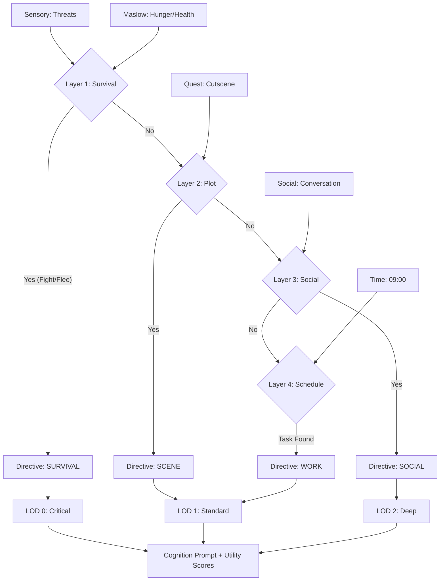

# Social, Work & Context LOD Integration Design

**Version:** 1.0  
**Status:** Planning  
**Source:** Hybrid of `Architecture_Simplification_Plan.md` & `Context_LOD_System.md`

## 1. Overview
This document outlines the integration of **Social Attributes** and **Work Schedules** with the **Context LOD (Level of Detail)** system. The goal is to create an AI that lives a daily life (Work/Rest) but dynamically scales its cognitive load based on the situation (LOD), ensuring performance during combat and depth during social interactions.

---

## 2. Infrastructure Systems

### 2.1 Time Manager (`UTimeManager`)
A subsystem to track the day/night cycle, driving schedules.
- **Role:** GameInstance Subsystem
- **API:** `float GetCurrentHour()` (0.0 - 24.0)
- **Time Scale:** Controlled multiplier (e.g., 1s real = 1m game).

### 2.2 Smart Object Manager (`USmartObjectManager`)
A registry for NPCs to find work stations and resources.
- **Role:** GameInstance Subsystem
- **Key Functions:** 
    - `RegisterResource(FGameplayTag JobTag, AActor* Object)`
    - `FindBestResourceFor(NPC, Tag)`

---

## 3. The "Brain" Arbitration System

The `GoalComponent` acts as the arbitrator, deciding *WHAT* to do effectively by filtering needs through layers, which naturally maps to **Context LOD**.

### 3.1 Goal Arbitration Hierarchy (The "Lizard Brain" Rule)

To prevent conflicts between "Scheduling" and "Survival" (OCEAN/Maslow), the `GoalComponent` enforces a strict hierarchy. **Survival needs always override Schedule.**

| Layer | Priority | Trigger Condition (Input) | Directive Output | Context LOD |
| :--- | :--- | :--- | :--- | :--- |
| **1. Survival** | **Highest** | `Sensory->ActiveThreat` OR `Hunger > 0.9` OR `Energy < 0.1` | **"SURVIVAL"** | **LOD 0** |
| **2. Plot (Future)** | **High** | `QuestSystem->HasActiveScene` | **"SCENE"** | **LOD 1/2** |
| **3. Social** | **Medium** | `Social->IsInConversation` | **"SOCIAL"** | **LOD 2** |
| **4. Schedule** | **Lowest** | Default (Time of Day) | **"WORK"** / **"REST"** | **LOD 1** |

### 3.2 Conflict Resolution Logic (The Director/Actor Pattern)
This system effectively acts as a **High-Level State Machine (The Director)** that sets the stage for the **Utility AI (The Actor)**.
-   **Director (`GoalComponent`)**: "The current scene is about Survival."
-   **Actor (`UtilityAI`)**: Decides *how* to survive (Fight vs. Flee) based on scores.

1.  **If Layer 1 (Survival) Triggered:**
    -   Directive becomes "SURVIVAL".
    -   `Action_Work` requires Directive "WORK". -> **Score becomes 0**.
    -   `Action_Eat` requires High Hunger. -> **Score remains High**.
    -   *Result:* NPC ignores work and eats/flees.

2.  **If Layer 3 (Schedule) Active:**
    -   Directive becomes "WORK" (e.g., at 9 AM).
    -   `Action_Work` gets a bonus (+2.0).
    -   *Result:* If not starving, NPC chooses to work.

```cpp
void UGoalComponent::UpdateArbitration()
{
    // 1. Survival Check (Maslow/OCEAN Override)
    if (MentalState->Hunger > 0.9f || Sensory->HasActiveThreat()) {
        SetDirective("SURVIVAL"); // Disables Work Actions
        Cognition->SetLOD(Critical);
        return;
    }

    // 2. Social Check
    if (Social->IsInDeepConversation()) {
        SetDirective("SOCIAL");
        Cognition->SetLOD(Deep);
        return;
    }

    // 3. Schedule Check (Default)
    Cognition->SetLOD(Standard);
    FScheduleTask Task = GetTaskForTime(TimeManager->GetCurrentHour());
    SetDirective(Task.TaskTag); // e.g., "WORK"
}
```

---

## 4. Work & Social Implementation

### 4.1 Profession System
Defined in `ProfessionConfig` DataTables.
- **Structure:** `FProfessionConfig`
    - `JobName`: e.g., "Miner"
    - `RequiredResourceTag`: e.g., "Work.Node.Ore"
    - `DefaultSchedule`: Array of Tasks (e.g., 08:00 -> Work, 18:00 -> Pub)

### 4.2 Work Action (`UAction_Work`)
- **Logic**:
    1. Check Profession -> Get Resource Tag.
    2. Query `SmartObjectManager` for nearest resource.
    3. Move to and Claim resource.
    4. Execute "Work" animation/logic.

### 4.3 Social Attributes (Mental State)
Updated `MentalStateFields.h` to support social dynamics:
- **Status**: (0.0 - 1.0) defines hierarchy.
- **Trust**: (0.0 - 1.0) defines relationship quality.
- **Anger**: (0.0 - 1.0) drives conflict.

---

## 5. Context LOD System (The "Cognitive Breathing")

Dynamic adjustment of LLM prompts based on the current situation (determined by Arbitration).

### 5.1 LOD Levels

#### LOD 0: Critical (Survival)
- **Use Case**: Combat, Fleeing, Starving.
- **Prompt**: Role + Current Threat ONLY. "ACT FAST."
- **Token Cost**: ~200.

#### LOD 1: Standard (Schedule/Work)
- **Use Case**: Working, Walking, Buying items.
- **Prompt**: Name, Role, Status, Recent Memory (Short). "Follow Routine."
- **Token Cost**: ~500.

#### LOD 2: Deep (Social/Reflect)
- **Use Case**: Deep conversation, Planning, Dreaming.
- **Prompt**: FULL Backstory, Relationships, Values. "Reflect Deeply."
- **Token Cost**: ~1000+.

### 5.2 Dynamic Prompt Assembly
The `CognitionComponent` assembles the prompt based on the current LOD set by the `GoalComponent`.

| Module | LOD 0 (Critical) | LOD 1 (Standard) | LOD 2 (Deep) |
| :--- | :--- | :--- | :--- |
| **Identity** | Role Only | Name, Role, Status | Full Profile |
| **Context** | Immediate Threat | Schedule/Job | Full History |
| **Output** | Tactical Intent | Routine Action | Nuanced Dialogue |

---

### 6. Implementation Roadmap

1.  **Infrastructure**: `TimeManager`, `SmartObjectManager`.
2.  **Core Logic**: `GoalComponent` with Arbitration + LOD Switching.
3.  **Professions**: Define simple Miner/Guard jobs.
4.  **LOD Integration**: Update `CognitionComponent` to respect LOD flags.

---

## 7. Addressing Critical Challenges (Industrial Best Practices)

To ensure the system is robust enough for a shipping game, the following mechanisms will be implemented to address common "Simulation vs. Gameplay" conflicts.

### 7.1 Resource Contention (The "Crowded Mine" Problem)
**Issue**: Multiple NPCs assigned to the same job type (e.g., Miner) may target the same Smart Object, causing stacking or "musical chairs."
**Solution: Reservation System**
-   **Logic**: Before moving, NPC calls `SmartObject->TryReserve(this)`.
-   **Failure**: If reservation fails (return false), NPC checks next best object.
-   **Fallback**: If all valid objects are full, **fallback to Social Mode (LOD 2)** (e.g., Chat with other waiters/idlers) instead of just standing still.

### 7.2 Transition Jitter (The "Instant Amnesia" Problem)
**Issue**: Momentary loss of Threat (e.g., enemy breaks LOS for 1s) causes instant switch from LOD 0 (Survival) back to LOD 1 (Work), looking robotic.
**Solution: Cognitive Inertia / Cooldown**
-   **Logic**: When leaving a high-priority state (Survival), enter a **"Cooldown State"** (e.g., `Alert`) for X seconds.
-   **Effect**: NPC remains in Combat Mode (Weapon drawn, scanning) even if Threat is 0, before gradually holstering and returning to work.
> [!NOTE] 
> **Future Refinement**: LOD 1 (Standard) prompts may need to partially include "Recent Threat Memory" during this cooldown phase to ensure the NPC talks about the danger ("What was that?") rather than immediately switching to "Nice weather today."

### 3.3 Arbitration Data Flow (Visualized)



---

## 4. Work & Social Implementation
... (Rest of document)

...

### 7.3 The Commute Problem (The "Eternal Walker")
**Issue**: Work starts at 9:00. If NPC starts walking at 9:00, they arrive late or spend all day walking.
**Solution: Early Departure with Time Slicing**
-   **Logic**: `GoalComponent` checks schedules *ahead* of time (e.g., `LookAheadAmount = 30min`).
-   **Optimization (Time Slicing)**: To prevent CPU explosion (1000 NPCs checking every frame), this check only runs:
    -   If NPC is currently in **LOD 1/2** (Inactive/Standard).
    -   At a low frequency (e.g., **Every 5.0s** with random offsets).
-   **Action**: If "Work" is upcoming, trigger `TravelToJob` directive early.


