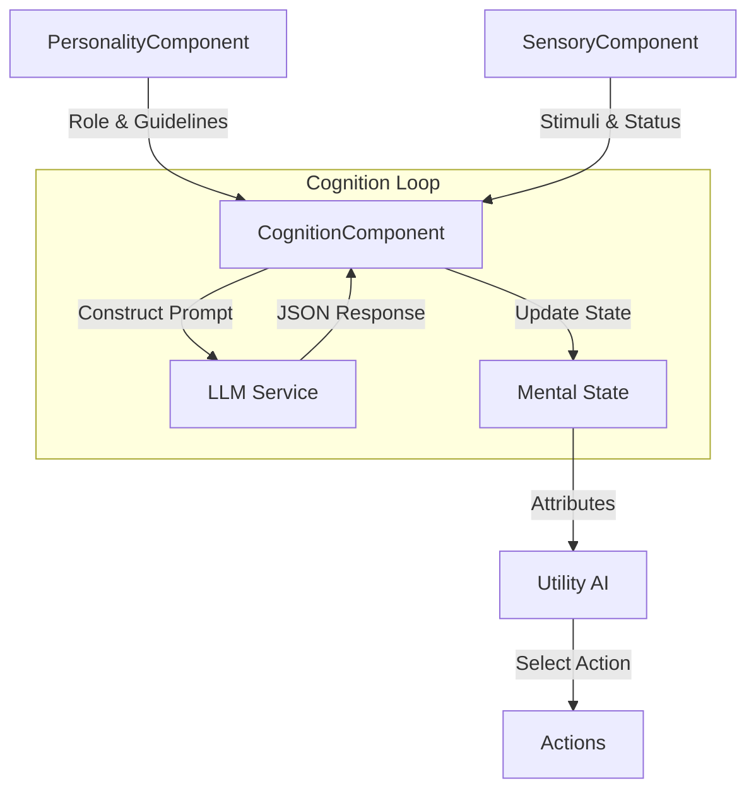

# AI Cognitive Workflow: Personality → Sensory → LLM
# AI 认知流程：个性 → 感知 → LLM

This document outlines the core data flow from static personality configuration to dynamic sensory perception, and finally to LLM-driven cognition.
本文档概述了从静态个性配置到动态感官知觉，最后到 LLM 驱动的认知的核心数据流。

## 1. High-Level Architecture / 高层架构

The system mimics a simplified human cognitive process:
系统模仿简化的类似人类的认知过程：

1.  **Personality (Who am I?)**: Defines the soul, memories, and behavioral rules.
2.  **Sensory (What is happening?)**: Collects environmental data and bodily status.
3.  **Cognition/LLM (What should I do?)**: Synthesizes (1) and (2) to update emotional states.



---

## 1.5 Personality Component Deep Dive / 个性组件深度解析

Before diving into the data flow, let's understand what Personality actually contains and how it shapes the AI.
在深入数据流之前，让我们先了解 Personality 实际包含什么以及它如何塑造 AI。

### Structure: FPersonalityConfig / 结构：FPersonalityConfig

The personality is defined by the `FPersonalityConfig` struct, which contains:
个性由 `FPersonalityConfig` 结构体定义，包含：

```cpp
struct FPersonalityConfig
{
    // === OCEAN Personality Traits (Big Five) ===
    float Openness;           // 开放性 (0.0 - 1.0)
    float Conscientiousness;  // 尽责性 (0.0 - 1.0)
    float Extraversion;       // 外向性 (0.0 - 1.0)
    float Agreeableness;      // 宜人性 (0.0 - 1.0)
    float Neuroticism;        // 神经质 (0.0 - 1.0)
    
    // === Role-Playing System ===
    FString RoleDescription;      // 角色描述 (Who am I?)
    FString BehavioralGuidelines; // 行为准则 (How should I act?)
};
```

### Component 1: OCEAN Traits (Big Five Model)
### 组件 1：OCEAN 特质（大五人格模型）

The Big Five personality traits provide a psychological foundation for the NPC's baseline behavior.
大五人格特质为 NPC 的基线行为提供心理学基础。

| Trait | 特质 | Low Value (0.0-0.3) | High Value (0.7-1.0) | Game Impact |
|-------|------|---------------------|----------------------|-------------|
| **Openness** | 开放性 | Conservative, traditional | Curious, creative | Affects exploration behavior, willingness to try new things |
| **Conscientiousness** | 尽责性 | Impulsive, disorganized | Disciplined, reliable | Affects task completion, patrol behavior |
| **Extraversion** | 外向性 | Reserved, solitary | Outgoing, energetic | Affects social interactions, group behavior |
| **Agreeableness** | 宜人性 | Competitive, skeptical | Cooperative, trusting | Affects combat aggression, alliance formation |
| **Neuroticism** | 神经质 | Calm, resilient | Anxious, emotional | Affects stress response, flee threshold |

**Current Usage (Limited):**
*   OCEAN traits are currently **stored** but not yet fully integrated into the LLM prompt or Utility AI scoring.
*   **Future Enhancement**: These could be used to:
    *   Modulate response curve shapes (e.g., high Neuroticism = steeper Flee curve).
    *   Add flavor text to LLM prompts (e.g., "You are naturally anxious...").

#### OCEAN → Maslow Transformation (PsychologyModel)
#### OCEAN → 马斯洛转换（心理学模型）

**Critical Mechanism**: OCEAN traits are **not just flavor text**. They mathematically influence the NPC's sensitivity to different needs through a **transformation matrix**.
**关键机制**: OCEAN 特质 **不仅仅是装饰文本**。它们通过 **转换矩阵** 数学上影响 NPC 对不同需求的敏感度。

The `UPsychologyModel` DataAsset defines **transformation coefficients** that convert OCEAN values into Maslow weights.
`UPsychologyModel` 数据资产定义了 **转换系数**，将 OCEAN 值转换为马斯洛权重。

##### Transformation Formula / 转换公式

**Basic Formula / 基础公式:**
```
MaslowWeight[Need] = OCEAN[Trait] × Coefficient[Trait→Need]
```

**Complex Formula (Multiple Traits) / 复杂公式（多特质影响）:**
```
MaslowWeight[Anger] = (Neuroticism × 2.5) - (Agreeableness × 1.5)
MaslowWeight[Resource_Anxiety] = (Neuroticism × 2.0) + (Conscientiousness × 1.5)
```

##### Complete Coefficient Matrix / 完整系数矩阵

| Maslow Need | 马斯洛需求 | OCEAN Influences | Combined Formula |
|-------------|-----------|------------------|------------------|
| **Perceived_Threat** | 威胁感 | Neuroticism × 3.0 | `N × 3.0` |
| **Anger** | 愤怒 | Neuroticism × 2.5<br>Agreeableness × -1.5 | `(N × 2.5) - (A × 1.5)` |
| **Loneliness** | 孤独感 | Extraversion × 2.5 | `E × 2.5` |
| **Trust** | 信任 | Agreeableness × 2.0 | `A × 2.0` |
| **Curiosity** | 好奇心 | Openness × 3.0 | `O × 3.0` |
| **Duty_Urgency** | 责任紧迫 | Conscientiousness × 2.5 | `C × 2.5` |
| **Social_Status** | 社会地位 | Extraversion × 1.8<br>Conscientiousness × 1.2 | `(E × 1.8) + (C × 1.2)` |
| **Resource_Anxiety** | 资源焦虑 | Neuroticism × 2.0<br>Conscientiousness × 1.5 | `(N × 2.0) + (C × 1.5)` |

##### Detailed Calculation Examples / 详细计算示例

**Example 1: High-Neuroticism Guard (高神经质守卫)**
```cpp
// Input OCEAN Profile
Neuroticism = 0.8
Agreeableness = 0.3
Conscientiousness = 0.7

// Weight Calculations
Perceived_Threat_Weight = 0.8 × 3.0 = 2.4
Anger_Weight = (0.8 × 2.5) - (0.3 × 1.5) = 2.0 - 0.45 = 1.55
Resource_Anxiety_Weight = (0.8 × 2.0) + (0.7 × 1.5) = 1.6 + 1.05 = 2.65

// Behavioral Impact
当 LLM 输出 Perceived_Threat = "Moderate" (0.5) 时:
实际影响 = 0.5 × 2.4 = 1.2 (超过正常值，被放大)

当 LLM 输出 Anger = "Slight" (0.25) 时:
实际影响 = 0.25 × 1.55 = 0.39 (轻微愤怒被放大)
```

**Behavioral Outcome / 行为结果:**
- This NPC is **hypersensitive** to threats (2.4× multiplier)
- Even minor provocations trigger **elevated anger** (1.55× multiplier)
- Constantly **worried about resources** (2.65× multiplier)
- **More likely to flee** from moderate threats
- **More likely to attack** when slightly provoked

**Example 2: High-Extraversion Merchant (高外向性商人)**
```cpp
// Input OCEAN Profile
Extraversion = 0.9
Agreeableness = 0.7
Neuroticism = 0.2

// Weight Calculations
Loneliness_Weight = 0.9 × 2.5 = 2.25
Trust_Weight = 0.7 × 2.0 = 1.4
Anger_Weight = (0.2 × 2.5) - (0.7 × 1.5) = 0.5 - 1.05 = -0.55 → Clamped to 0.1

// Behavioral Impact
当 NPC 独处 30 秒后:
Loneliness 值上升到 0.6
实际影响 = 0.6 × 2.25 = 1.35 (强烈的社交需求)

当遇到陌生人时:
Trust = "Moderate" (0.5)
实际影响 = 0.5 × 1.4 = 0.7 (倾向于信任)
```

**Behavioral Outcome / 行为结果:**
- **Actively seeks social interaction** (2.25× loneliness sensitivity)
- **Trusts strangers easily** (1.4× trust multiplier)
- **Rarely gets angry** (anger weight near zero)
- **Prefers negotiation over combat**

##### Impact on Utility AI Scoring / 对 Utility AI 评分的影响

**Without OCEAN Weights (旧系统):**
```cpp
// All NPCs react the same way
Flee_Score = BaseReward × Perceived_Threat
           = 3.0 × 0.5 = 1.5
```

**With OCEAN Weights (新系统):**
```cpp
// Anxious NPC (Neuroticism = 0.8)
Flee_Score = BaseReward × (Perceived_Threat × Weight)
           = 3.0 × (0.5 × 2.4) = 3.6  // 更容易逃跑

// Brave NPC (Neuroticism = 0.2)
Flee_Score = BaseReward × (Perceived_Threat × Weight)
           = 3.0 × (0.5 × 0.6) = 0.9  // 不太容易逃跑
```

**Key Insight / 关键洞察:**
> **相同的 LLM 输出 + 不同的 OCEAN 特质 = 不同的行为结果**
> 
> Same LLM output + Different OCEAN traits = Different behavioral outcomes

This is how personality creates **behavioral diversity** without requiring different LLM prompts.
这就是性格如何在不需要不同 LLM 提示的情况下创造 **行为多样性**。

##### Code Implementation / 代码实现

```cpp
// PersonalityComponent.cpp
void UPersonalityComponent::BeginPlay()
{
    Super::BeginPlay();
    
    // Load personality from DataTable
    LoadPersonalityFromDataTable();
    
    // Calculate Maslow weights (ONE-TIME calculation)
    if (PsychologyModel)
    {
        MaslowWeights = PsychologyModel->RecalculateWeights(PersonalityConfig);
        
        // Debug logging
        UE_LOG(LogTemp, Log, TEXT("=== Maslow Weights Calculated ==="));
        UE_LOG(LogTemp, Log, TEXT("  Perceived_Threat: %.2f"), MaslowWeights.PerceivedThreatWeight);
        UE_LOG(LogTemp, Log, TEXT("  Anger: %.2f"), MaslowWeights.AngerWeight);
        UE_LOG(LogTemp, Log, TEXT("  Loneliness: %.2f"), MaslowWeights.LonelinessWeight);
    }
}

// PsychologyModel.cpp
FMaslowWeights UPsychologyModel::RecalculateWeights(const FPersonalityConfig& Personality)
{
    FMaslowWeights Weights;
    
    // Single-trait mappings
    Weights.PerceivedThreatWeight = Personality.Neuroticism * Neuroticism_To_Threat;
    Weights.LonelinessWeight = Personality.Extraversion * Extraversion_To_Loneliness;
    Weights.TrustWeight = Personality.Agreeableness * Agreeableness_To_Trust;
    
    // Multi-trait mappings
    Weights.AngerWeight = FMath::Max(0.1f, 
        (Personality.Neuroticism * Neuroticism_To_Anger) - 
        (Personality.Agreeableness * Agreeableness_To_Anger));
    
    return Weights;
}
```

**Performance Considerations / 性能考虑:**
- **Calculation Frequency**: Once at `BeginPlay()` (一次性计算)
- **Per-Frame Overhead**: ~0.0ms (使用预计算的权重)
- **Total Impact**: Negligible (可忽略不计)

**📖 详细文档 / Detailed Documentation:**
完整的数据流和转换机制请参考: `docs/design/Personality_OCEAN_Maslow_LLM_Pipeline.md`
For complete data flow and transformation mechanisms, see: `docs/design/Personality_OCEAN_Maslow_LLM_Pipeline.md`


### Component 2: Role Description (角色描述)
### 组件 2：角色描述

**Purpose**: Defines the NPC's identity, background, and core nature.
**目的**: 定义 NPC 的身份、背景和核心本质。

**Injection Point**: Becomes part of the **System Prompt** sent to the LLM.
**注入点**: 成为发送给 LLM 的 **系统提示** 的一部分。

**Best Practices:**
*   Use **second person** ("You are...") for immersion.
*   Be **specific** about key traits that affect decision-making.
*   Mention **motivations** and **fears**.

**Examples:**

#### Zombie (僵尸)
```
"You are a mindless zombie infected by a virus. You have an insatiable 
hunger for living flesh. You feel no pain and no fear. Your only drive 
is to feed."
```
*   **Key Traits**: Mindless, fearless, hungry.
*   **Impact**: LLM will never set `Fear` high, always prioritize attack.

#### Royal Guard (皇家守卫)
```
"You are a disciplined royal guard sworn to protect the castle. You are 
suspicious of strangers but respectful to nobility. Your duty comes before 
personal safety."
```
*   **Key Traits**: Dutiful, suspicious, brave.
*   **Impact**: High `Duty_Urgency`, moderate `Perceived_Threat` for strangers.

#### Merchant (商人)
```
"You are a shrewd merchant who values profit above all. You are friendly 
to customers but ruthless in negotiations. You avoid violence as it's 
bad for business."
```
*   **Key Traits**: Greedy, non-violent, social.
*   **Impact**: High `Trust` for customers, low `Anger` even when insulted.

### Component 3: Behavioral Guidelines (行为准则)
### 组件 3：行为准则

**Purpose**: Enforces **game logic** and **hard rules** that override the LLM's default reasoning.
**目的**: 强制执行 **游戏逻辑** 和 **硬规则**，覆盖 LLM 的默认推理。

**Why Needed?**
*   LLMs are trained to be helpful, harmless, and honest. They may resist outputting "evil" or "irrational" behavior.
*   Game characters often need to behave in ways that violate real-world ethics (e.g., zombies attacking innocents).
*   Guidelines **force** the LLM to map narrative states to specific mental state values.

**Format**: Numbered list of explicit instructions.
**格式**: 明确指令的编号列表。

**Examples:**

#### Zombie Guidelines (僵尸准则)
```
1. Attack any human immediately upon detection.
2. Your insatiable hunger translates to EXTREME Anger (set Anger to 1.0).
3. You are mindless, so Perceived_Threat is always 'None' (0.0).
4. Your Trust in all entities is 'None' (0.0).
5. You never feel Fear, regardless of damage taken.
```

**Why Each Rule Matters:**
*   **Rule 1**: Ensures the LLM doesn't try to "negotiate" or "flee" first.
*   **Rule 2**: **Critical Mapping**: Maps the narrative concept "Hunger" (which is Engine-Managed) to the psychological state "Anger" (which drives Utility AI's Attack action).
*   **Rule 3-5**: Prevent the LLM from making the zombie "too smart" or "too human".

#### Guard Guidelines (守卫准则)
```
1. Strangers without noble attire trigger 'Moderate' Perceived_Threat (0.5).
2. If a stranger approaches the gate, set Duty_Urgency to 'High' (0.8).
3. Nobles are trusted (Trust = 0.9).
4. You will defend the gate even at low health (do not flee unless ordered).
```

### How Personality Flows to LLM / 个性如何流向 LLM

**Step-by-Step:**

1.  **Initialization** (`UtilityAIController::BeginPlay`):
    ```cpp
    FString Role = PersonalityComp->GetRoleDescription();
    FString Guidelines = PersonalityComp->GetBehavioralGuidelines();
    CognitionComp->SetRoleConfiguration(Role, Guidelines);
    ```

2.  **Storage** (`CognitionComponent`):
    ```cpp
    FString RoleDescription;      // Stored
    FString BehavioralGuidelines; // Stored
    ```

3.  **Prompt Construction** (`CognitionComponent::ProcessStimulus`):
    ```cpp
    FString SystemPrompt = FString::Printf(TEXT(
        "You are an NPC in a game.\n"
        "Role: %s\n"
        "Guidelines:\n%s\n"
        "Output your mental state as JSON..."
    ), *RoleDescription, *BehavioralGuidelines);
    ```

4.  **LLM Receives**:
    ```
    System: "You are a zombie... Guidelines: 1. Attack humans..."
    User: "You see a human 5m away. Hunger=80."
    ```

5.  **LLM Outputs** (Guided by Guidelines):
    ```json
    {
        "Anger": "Extreme",
        "Perceived_Threat": "None",
        "Trust": "None"
    }
    ```

6.  **Cognition Parses & Filters**:
    *   Converts "Extreme" -> 1.0
    *   **Rejects** any attempt to modify `Hunger` (Engine-Exclusive)
    *   Updates `MentalState->Anger = 1.0`

---

## 2. Detailed Data Flow / 详细数据流

### Phase 1: Personality Injection (Initialization)
### 第一阶段：个性注入（初始化）

*   **Source**: `UPersonalityComponent`
*   **Data**: `RoleDescription`, `BehavioralGuidelines`, `OCEAN Traits`.
*   **Action**: 
    *   On `BeginPlay`, the `UtilityAIController` fetches these strings.
    *   It passes them to `UCognitionComponent::SetRoleConfiguration`.
*   **Purpose**: This sets the "System Prompt" (The instruction manual for the LLM).

### Phase 2: Sensory Perception (Runtime)
### 第二阶段：感官知觉（运行时）

*   **Source**: `USensoryComponent`
*   **Data**: 
    *   `VisualStimuli`: What actors are nearby?
    *   `AuditoryStimuli`: What sounds are heard?
    *   `BodyStatus`: Health, Hunger, Energy (Engine-Managed values).
*   **Action**:
    *   When a significant event works (or Dreaming triggers), Sensory gathers a snapshot of the world.
    *   It formats this into a narrative string (e.g., "You see a Player nearby. You are hungry.").

### Phase 3: Prompt Construction (The Synthesis)
### 第三阶段：提示构建（合成）

The `UCognitionComponent` combines inputs into a single request:

**1. System Prompt (The Persona)**
> "You are a mindless zombie... (Role)
> Guidelines: 1. Attack humans. 2. Hunger equals Anger..."

**2. User Input (The Context)**
> "Current Status: Health=100, Hunger=80.
> Sensory Input: You see a human 5 meters away."

### Phase 4: LLM Processing & Output
### 第四阶段：LLM 处理与输出

*   The LLM analyzes the context *through the lens* of the Persona.
*   **Example Logic**:
    *   "I am a zombie" + "I see a human" + "Guideline: Attack humans"
    *   -> **Result**: Increase `Anger` to 1.0, Set `Perceived_Threat` to 0.
*   **Output Format**: JSON structures containing target values for attributes.

### Phase 5: State Update & Filtration
### 第五阶段：状态更新与过滤

*   **Receiver**: `UCognitionComponent::OnLLMReply`
*   **Filtration Rule**:
    *   The code inspects the JSON.
    *   It **REJECTS** changes to Engine-Exclusive values (`Health`, `Hunger`, `Energy`).
    *   It **ACCEPTS** changes to Psychological values (`Anger`, `Trust`, `Curiosity`).
*   **Result**: The `UNPCMentalState` is updated.
    *   `Anger` -> 1.0

### Phase 6: Utility Execution
### 第六阶段：Utility 执行

*   The `UtilityAIComponent` reads the updated `MentalState`.
*   It scores actions based on the new state.
    *   `Test_Attack`: Scored high (because Anger is high).
    *   `Test_Idle`: Scored low.
*   The NPC executes the Attack.

---

## 3. Code References / 代码参考

| Component | File | Key Function |
|-----------|------|--------------|
| **Personality** | `PersonalityComponent.cpp` | `GetRoleDescription()`, `GetBehavioralGuidelines()` |
| **Controller** | `UtilityAIController.cpp` | `BeginPlay` (Injects personality to cognition) |
| **Sensory** | `SensoryComponent.cpp` | `ProcessStimulus()` or `GetCurrentStatus()` |
| **Cognition** | `CognitionComponent.cpp` | `ProcessStimulus()` (Prompt Building), `OnLLMReply()` (Parsing) |
| **MentalState** | `UNPCMentalState.h` | Stores the runtime attribute values |

## 4. Key Design Decisions / 关键设计决策

1.  **Stateless LLM (Ideally)**: We send the relevant context in every prompt (Role + Status + Stimulus) so the LLM doesn't need to maintain long history, reducing token usage and error accumulation.
2.  **Hard Rules (Guidelines)**: We use `BehavioralGuidelines` to enforce game logic (e.g., "Zombies don't feel fear") which overrides the LLM's default "polite assistant" bias.
3.  **One-Way Control**: The LLM controls the *mind* (Anger, Intent), but the Engine controls the *body* (Health, Physics). The LLM cannot "will" itself to have more health.
